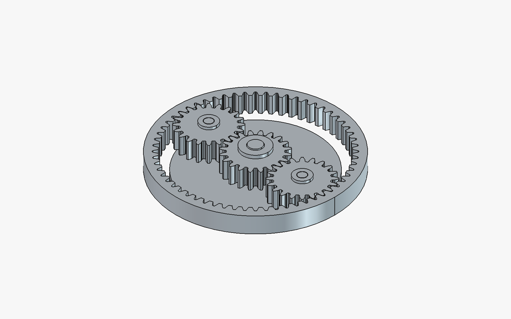

<p align="center">
  
</p>

<h1 align="center">TALOS</h1>

<p align="center"><strong>FreeCAD MCP seguro, estruturado e orientado a agentes.</strong></p>

TALOS é um servidor MCP para controlar o FreeCAD com ferramentas CAD estruturadas. Agentes
como Codex, Claude Code e Cursor podem inspecionar, modelar, validar e exportar
peças sem executar Python, macros ou comandos arbitrários.

O FreeCAD é o motor geométrico. Schemas, política de risco, planos, auditoria e
regras do produto permanecem independentes dele.

## Estado atual

- FreeCAD 1.1.1 instalado no Windows;
- Workbench **TALOS MCP** com painel de ponte, capacidades, aprovações e atividade;
- 92 ferramentas no mesmo `ToolRegistry` para a ponte e o servidor MCP;
- M0 a M7 concluídos; E1 — MCP em escala em execução;
- modelagem básica e avançada, Sketch, montagens, rolamentos e exportação;
- mutações transacionais, validadas, auditadas e reversíveis;
- erros MCP categorizados, recuperáveis e com estado seguro explícito;
- descoberta compacta e paginada, com schemas completos somente sob demanda;
- captura multivista e vistas em corte XY/XZ/YZ com restauração do viewport;
- `inspect_cad_model` para contexto, validação, medidas e imagens em uma chamada;
- telemetria em memória para bytes/tokens estimados, bridge, GUI e confirmação;
- confirmação visível por padrão; `TALOS_AUTO_APPROVE=1` aprova automaticamente apenas mutações compensáveis, e exportações são sempre manuais.

O painel não expõe chat interno, seletor de provedor nem campo de chave. A IA
embutida foi removida: o modelo é sempre escolhido pelo agente externo que
conecta ao MCP.

### Atualizações recentes

- E1.1 concluída com busca escalável de capacidades e schemas sob demanda;
- erros recuperáveis compartilhados entre catálogo, ponte e MCP;
- capturas independentes de vários ângulos em uma única chamada;
- corte visual não destrutivo por plano e offset;
- framebuffer estabilizado antes da captura para evitar imagens parciais;
- baseline holdout separada com rank-1, MRR, precisão@K e falsos positivos.

## Início rápido

1. Prepare a `.venv` e vincule o Workbench conforme
   [docs/installation.md](docs/installation.md).
2. Abra o FreeCAD normalmente.
3. Selecione o Workbench **TALOS MCP**.
4. Mantenha o painel aberto para publicar a ponte MCP.
5. Conecte seu agente seguindo [docs/mcp-integration.md](docs/mcp-integration.md).

O repositório já inclui `.mcp.json`. No uso diário não é necessário iniciar o
FreeCAD por script. O painel também oferece a configuração MCP pronta para copiar.

## O que o catálogo cobre

| Área | Capacidades principais |
| --- | --- |
| Contexto | documentos, seleção, medidas, vistas múltiplas e cortes visuais |
| Primitivas | caixa, cilindro, cone, esfera, toro e placas |
| Sketch | 24 ferramentas de geometria, restrições, cotas, edição e inspeção |
| Features | pad, revolução, loft, sweep, furos, booleanas, filetes e chanfros |
| Repetição | espelho, padrões lineares, polares e padrões de furos |
| Mecânica | engrenagens, roscas, montagens, interferência e alinhamento |
| Rolamentos | modelos convencionais e adaptados à impressão 3D |
| Saída | salvamento `.FCStd`, exportação STL e STEP |

Use `search_cad_capabilities` para encontrar cartões compactos e
`describe_cad_capabilities` para carregar somente os schemas escolhidos.
`available_cad_tools` permanece como compatibilidade e auditoria completa.
Para verificação, `inspect_cad_model` agrupa as leituras comuns e confirma por
`DocumentStateToken` que o documento não mudou durante a inspeção.
`get_mcp_performance_snapshot` mostra métricas apenas do processo atual, sem
armazenar argumentos, nomes de arquivos ou conteúdo dos pedidos.

## Exemplo validado

Estágio planetário 60/20/20 com dois planetas opostos, validado no FreeCAD sem interferências entre os quatro engrenamentos.



## Fluxo seguro

1. O agente lê o documento e resolve referências.
2. Um plano usa somente ferramentas registradas.
3. O painel aplica a política de aprovação visível.
4. Cada mutação abre uma transação, recalcula e valida o documento.
5. Falhas abortam a operação; planos compostos fazem rollback verificado.
6. O agente mede ou captura o resultado antes de exportar.

Não existe ferramenta para executar código arbitrário. Chaves não são gravadas
no projeto e caminhos locais sensíveis são removidos da auditoria.

## Desenvolvimento

Instale o projeto em modo editável e execute a suíte completa antes de concluir
uma alteração:

```powershell
powershell.exe -NoProfile -ExecutionPolicy Bypass -File .\scripts\testar.ps1
```

A verificação local inclui Ruff, checagem de tipos do núcleo, cobertura mínima,
testes unitários, oito smokes no FreeCADCmd e o smoke gráfico do painel MCP.
A mesma base neutra roda no CI do Windows sem exigir uma instalação do FreeCAD.

A suíte cobre mais de 200 testes unitários, FreeCADCmd e a interface gráfica real. Para
medir a seleção de ferramentas sem rede ou FreeCAD:

```powershell
.\scripts\benchmark_agent.ps1
.\scripts\benchmark_agent.ps1 -Corpus benchmarks\agent-corpus-heldout-v1.json
```

Os corpora históricos verificam regressões conhecidas. O corpus `heldout` não
reutiliza frases canônicas do catálogo e mede rank-1, MRR, precisão@K,
esclarecimentos e exposição indevida de mutações. A economia de schema reportada
é teórica e assume ausência de cache no cliente MCP.

## Regras do repositório

- MCP é o produto principal; a IA embutida recebe apenas manutenção.
- FreeCAD permanece atrás do adaptador.
- Chat e MCP usam o mesmo `ToolRegistry`.
- Toda mutação CAD é transacional, validada e reversível.
- Nenhuma ferramenta executa Python, macro ou shell arbitrário.
- Código neutro deve continuar testável sem FreeCAD instalado.

## Documentação

- [Instalação](docs/installation.md)
- [Integração MCP](docs/mcp-integration.md)
- [Arquitetura](docs/architecture.md)
- [Ambiente de Sketch](docs/sketch-environment.md)
- [Rolamentos](docs/bearings.md)
- [Auditoria](docs/audit.md)
- [Visão do produto](docs/product-vision.md)
- [Baseline M0–M7](docs/milestones.md)
- [Otimização do agente](docs/ai-agent-optimization-plan.md)
- [E1 — MCP em escala](docs/mcp-scale-roadmap.md)
