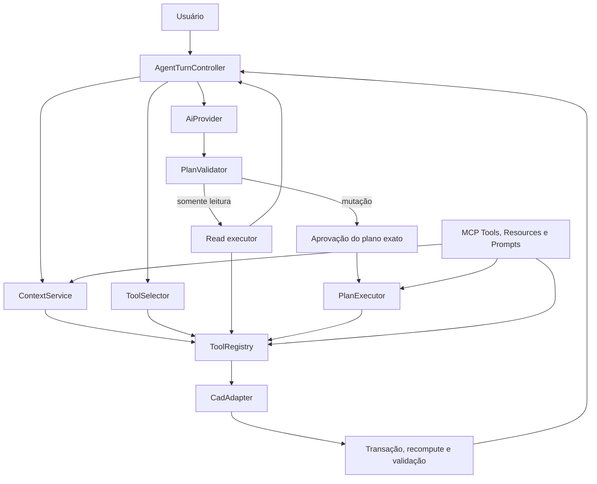

# AI CAD Workbench — plano de otimização da IA e das ferramentas

Este documento define a nova sequência técnica para tornar o uso por linguagem
natural mais rápido, previsível e capaz, sem enfraquecer a segurança já construída.
Ele detalha o M3 e orienta a ordem do M4. Quando houver diferença de prioridade,
este plano prevalece para a evolução do agente; os marcos M0, M1 e M2 continuam
como registrados em `docs/milestones.md`.

## 1. Ponto de partida

- **Data da análise:** 14 de julho de 2026.
- **Baseline local:** `971df80` — `Add transactional cylinder tool`.
- **Estado do Git na análise:** `main` limpa e sincronizada com `origin/main`.
- **Validação inicial:** 73 testes unitários, `FREECAD_SMOKE_OK` e
  `FREECAD_GUI_SMOKE_OK`.
- **Estado do M3.1:** concluído após essa baseline, com 88 testes unitários.
- **Estado do M3.2:** concluído, com 94 testes unitários e smokes reais.
- **Estado do M3.3:** concluído, com 103 testes e benchmark local do seletor.
- **Estado do M3.4:** concluído, com 110 testes e smokes reais.
- **Estado do M3.5:** concluído, com 115 testes e execução real por plano aprovado.
- **Estado do M3.6:** concluído com 126 testes, rollback real e planos via MCP.
- **Capacidades atuais:** resumo, seleção, caixa, cilindro, validação e undo.
- **IA atual:** até quatro rodadas, leituras retornam ao modelo e mutações encerram
  a descoberta sem execução automática.

O objetivo não é fazer a IA receber mais permissões. O objetivo é fazê-la obter o
contexto certo, escolher melhor entre ferramentas pequenas e seguras, executar
leituras úteis, revisar o plano e só então solicitar a autorização estritamente
necessária.

## 2. Regras que não podem ser negociadas

1. O modelo nunca executa texto, Python, macro, expressão ou comando de sistema.
2. Chat interno e MCP usam o mesmo `ToolRegistry`, os mesmos schemas, os mesmos
   handlers e a mesma política de risco.
3. Toda mutação é validada antes, executada em transação, validada depois e pode
   ser revertida.
4. Uma aprovação autoriza somente um plano imutável, conhecido e ainda atual; não
   concede permissão genérica para a sessão.
5. Alterar argumentos, ferramentas ou estado-base invalida a aprovação.
6. A thread de transporte e a thread da IA não acessam o FreeCAD diretamente.
7. Segredos permanecem no cofre do Windows e só são lidos no envio explicitamente
   habilitado pelo usuário.
8. Otimizações precisam ser medidas. Não trocar transporte, modelo ou arquitetura
   apenas por impressão de velocidade.
9. O modo local determinístico continua disponível sem provedor.
10. Nenhum recurso novo pode exigir reinstalar ou baixar novamente o FreeCAD.

## 3. O que significa "mais rápido e melhor"

Quatro dimensões serão medidas separadamente:

| Dimensão | Medida principal | Falha que deve evitar |
| --- | --- | --- |
| Rapidez percebida | tempo até o primeiro estado útil na UI | painel parecer travado |
| Rapidez total | tempo do envio ao resultado validado | muitas rodadas desnecessárias |
| Eficiência | tokens, ferramentas expostas e chamadas CAD | enviar o catálogo inteiro sempre |
| Qualidade | tarefa concluída, chamada válida e resultado correto | operação rápida, porém errada |

Segurança é uma trava, não uma dimensão negociável: execução sem aprovação,
mutação não reversível e código arbitrário têm meta permanente igual a zero.

## 4. Gargalos confirmados na implementação atual

1. O painel cria o orquestrador com `max_tool_calls=1`.
2. A interface usa somente `payload.tool_calls[0]`.
3. Resultados de leitura não voltam ao modelo; portanto ele não consegue observar,
   corrigir e continuar no mesmo pedido.
4. O contexto contém apenas o resumo básico do documento; seleção, propriedades,
   relações, medidas e última alteração não são parte de um contrato de contexto.
5. Cada envio cria um novo `DeepSeekProvider` e, sem cliente injetado, um novo
   `httpx.Client`.
6. Não há estado estruturado de conversa para resolver referências como "ele",
   "a mesma peça" ou "deixe 10% maior".
7. O plano não possui uma revisão do documento nem um hash que impeça aplicar uma
   intenção antiga sobre um estado novo.
8. O `ToolSpec` descreve schema e risco, mas ainda não possui metadados suficientes
   para busca, pré-condições, custo, exemplos e schema de saída.
9. A ponte é acordada por timer de 50 ms e o cliente TCP abre uma conexão por
   request. Esses custos devem ser medidos antes de receber prioridade.
10. Não existe corpus de pedidos naturais para comparar uma otimização com a
    baseline.

## 5. Inspeção de projetos existentes

Os projetos abaixo são referências de inspeção, não dependências nem fontes para
copiar código. Toda implementação nova continuará sendo adequada às regras deste
repositório e à licença de cada origem.

| Referência | O que já demonstrou | O que aproveitar | O que rejeitar |
| --- | --- | --- | --- |
| [neka-nat/freecad-mcp](https://github.com/neka-nat/freecad-mcp) | ponte XML-RPC, fila na thread gráfica, screenshots e conexão persistente | fila segura, retorno visual opcional e descrições úteis | `execute_code` e acesso genérico a objetos |
| [contextform/freecad-mcp](https://github.com/contextform/freecad-mcp) | famílias de operações e continuação após seleção interativa | descoberta hierárquica e protocolo `awaiting_selection` | `execute_python` e um dispatcher amplo como fronteira de segurança |
| [Robust MCP Server](https://github.com/spkane/freecad-addon-robust-mcp-server) | catálogo grande, Resources, Prompts, diagnóstico e recuperação de conexão | recursos de contexto, prompts guiados, schemas de saída e observabilidade | macros/Python, múltiplos transportes prematuros e 150 ferramentas antes de métricas |
| [jango-blockchained/mcp-freecad](https://github.com/jango-blockchained/mcp-freecad) | provedores modulares, mock, cache e recuperação | adaptadores testáveis, diagnóstico e recuperação controlada | seis modos de conexão sem necessidade comprovada |
| [ghbalf/freecad-ai](https://github.com/ghbalf/freecad-ai) | tool reranking, contexto do documento, skills, streaming e autocorreção | seleção top-N, receitas, memória estruturada, progresso e retry limitado | fallback de código, macros e modo perigoso |

Conclusões práticas:

- cobertura ampla ajuda, mas catálogo enorme sem recuperação aumenta tokens e
  erros de escolha;
- screenshots ajudam na verificação, mas são caras demais para acompanhar toda
  rodada;
- seleção interativa resolve pedidos baseados em faces e arestas melhor do que
  adivinhar índices topológicos;
- Resources são adequados para contexto, Prompts para fluxos escolhidos pelo
  usuário e Tools para ações; essa separação já existe na
  [especificação MCP](https://modelcontextprotocol.io/specification/2025-06-18/server/index);
- a DeepSeek documenta o ciclo correto de devolver resultados de ferramentas ao
  modelo e continuar a conversa em
  [Tool Calls](https://api-docs.deepseek.com/guides/tool_calls);
- o cache de contexto da DeepSeek funciona por prefixos repetidos. Ordenação
  estável de instruções e schemas deve ser preservada e os campos
  `prompt_cache_hit_tokens` e `prompt_cache_miss_tokens` devem ser medidos, conforme
  [a documentação oficial](https://api-docs.deepseek.com/guides/kv_cache/).

## 6. Arquitetura-alvo



O MCP e o painel são fachadas. `ContextService`, `ToolSelector`, `PlanValidator`,
`PlanExecutor` e `ToolRegistry` formam a trilha compartilhada. Não haverá lógica
CAD duplicada dentro do servidor MCP.

## 7. Contratos novos

### 7.1 Metadados de ferramenta

Evoluir `ToolSpec` com campos opcionais e neutros:

- `category` e `tags` para recuperação;
- `aliases_pt` e `aliases_en` para linguagem natural;
- `preconditions` declarativas;
- `effects` esperados;
- `output_schema` para validar e compactar resultados;
- `examples` curtos, testados e sem código;
- `estimated_cost` como `cheap`, `normal` ou `expensive`;
- `supports_dry_run`, inicialmente falso;
- `result_verbosity`, com formato resumido para IA e detalhado para auditoria.

Esses campos ajudam o roteamento, mas nunca substituem o schema de entrada, o
risco autoritativo ou a validação do handler.

### 7.2 `DocumentStateToken`

Identifica o estado usado para planejar:

- ID da sessão gráfica;
- ID e nome interno do documento;
- contador monotônico das mutações conhecidas;
- fingerprint compacto dos objetos e propriedades relevantes;
- timestamp apenas para diagnóstico, nunca para decidir igualdade.

O contador cobre ações pelo registro. O fingerprint ou observadores do FreeCAD
precisam detectar alterações manuais. O método exato será escolhido por um teste
curto antes de virar contrato definitivo.

### 7.3 `ContextSnapshot`

Contrato JSON versionado com níveis progressivos:

- **L0 — mínimo:** documento, unidades, revisão e contagem de objetos;
- **L1 — trabalho:** seleção, objetos recentes, nomes, tipos e estado de erro;
- **L2 — sob demanda:** propriedades, medidas, relações e referências geométricas
  dos objetos relevantes;
- **L3 — visual:** screenshot e câmera, somente quando solicitado ou necessário
  para verificação.

O snapshot tem limites por quantidade e bytes. Objetos excedentes produzem resumo
e cursor, nunca truncamento silencioso.

### 7.4 `ValidatedPlan`

Um plano aceito localmente contém:

- `plan_id`, versão e `base_state_token`;
- intenção, suposições e perguntas pendentes;
- chamadas ordenadas com IDs únicos;
- argumentos já validados pelo registro;
- riscos vindos do registro, não do modelo;
- efeitos e validações esperados;
- orçamento de chamadas e prazo;
- hash canônico de todos os campos executáveis.

### 7.5 `ApprovalGrant`

A aprovação substitui gradualmente o booleano genérico `confirmed=True`. Ela
contém o hash do plano, IDs autorizados, origem, prazo curto e decisão do usuário.
Não contém segredo. Qualquer diferença de plano ou documento torna o grant
inválido.

### 7.6 `ToolResultEnvelope`

Toda ferramenta retorna uma estrutura previsível:

- status e código de erro categorizado;
- resultado validado;
- objetos lidos, criados, alterados ou removidos;
- estado anterior e posterior quando aplicável;
- resumo curto para o modelo;
- detalhes para UI/auditoria;
- validações realizadas;
- duração e novo `DocumentStateToken`.

## 8. Seleção eficiente de ferramentas

Não começar com embeddings nem com uma segunda chamada ao modelo.

Primeira versão do `ToolSelector`:

1. normaliza texto em português e inglês;
2. pontua nome, aliases, categoria, tags, descrição e exemplos;
3. considera seleção, tipo dos objetos e etapa atual do plano;
4. fixa ferramentas essenciais de contexto quando necessárias;
5. retorna top-N estável, inicialmente até 8;
6. usa fallback seguro para o catálogo da categoria quando a confiança for baixa;
7. registra pontuação e motivo para o benchmark.

Famílias como `primitive`, `measure`, `transform`, `partdesign` e `view` servem
para descoberta. A operação final continua sendo uma ferramenta pequena do
registro. Não criar uma única `part_operations` com dezenas de argumentos como
fronteira executável.

Um reranker por modelo ou embeddings só será considerado se o seletor local não
atingir o recall definido no benchmark. Isso evita latência, custo e dependência
antes de haver necessidade.

## 9. Contexto e memória de trabalho

### Contexto enviado ao provedor

Manter a parte estável do prompt sempre na mesma ordem:

1. regras imutáveis;
2. schemas selecionados em ordem canônica;
3. receitas aplicáveis;
4. resumo estruturado da sessão;
5. delta mais recente do documento;
6. mensagem atual.

Isso reduz repetição lógica e favorece cache de prefixo. O documento inteiro não
deve ser reenviado quando apenas um objeto mudou.

### Memória da sessão

Manter inicialmente somente em memória:

- restrições declaradas pelo usuário;
- aliases resolvidos, como "o eixo" → `Cylinder001`;
- objetos criados ou alterados recentemente;
- decisões e suposições ainda válidas;
- últimos resultados compactados;
- plano pendente e motivo de pausa.

Mensagens antigas viram fatos estruturados com origem. Fatos são invalidados
quando a revisão do documento os torna obsoletos. Persistência fica para o marco
de auditoria e nunca incluirá chave de API.

## 10. Loop controlado do agente

Estados propostos:

```text
PREPARE_CONTEXT -> SELECT_TOOLS -> ASK_MODEL -> VALIDATE_PLAN
VALIDATE_PLAN -> EXECUTE_READS -> ASK_MODEL
VALIDATE_PLAN -> AWAIT_APPROVAL -> EXECUTE_MUTATIONS -> VERIFY
qualquer estado -> CANCELLED | FAILED
VERIFY -> DONE | ASK_MODEL
```

Limites iniciais, ajustáveis depois do benchmark:

- até 4 rodadas com o provedor;
- até 8 chamadas totais;
- até 6 leituras e 2 mutações propostas;
- uma mutação ativa por vez;
- até 45 segundos de orçamento local por turno, sem contar tempo aguardando o
  usuário;
- limite de bytes para contexto, resultados e screenshot;
- cancelamento visível e cooperativo em cada ponto seguro.

Regras do loop:

- leituras baratas podem executar automaticamente;
- leituras caras precisam de política explícita;
- mutações nunca executam durante a fase de descoberta;
- falta de dimensão, objeto ou referência importante gera pergunta curta ao
  usuário, não adivinhação;
- resultado de ferramenta retorna como mensagem de ferramenta, mantendo ID e
  ordem;
- mudança de argumentos após erro produz plano novo;
- não há modo infinito.

## 11. Planos com várias operações

### Primeira entrega

O loop aprende a executar várias leituras, mas continua aprovando e executando uma
única mutação. Isso entrega aprendizado contextual com risco baixo.

### Entrega composta

Depois de validar a primeira entrega:

1. congelar e hashear o plano;
2. apresentar todas as mutações e efeitos esperados em uma única revisão;
3. conferir que o documento ainda corresponde ao estado-base;
4. adquirir um bloqueio curto de execução na GUI;
5. pré-validar todas as chamadas antes da primeira alteração;
6. executar cada chamada pela transação já pertencente ao adaptador;
7. validar após cada chamada e validar o documento ao final;
8. registrar exatamente quantas transações pertencem ao plano;
9. em falha, desfazer somente essas transações, em ordem inversa;
10. validar que o estado foi restaurado antes de reportar rollback completo.

Não presumir que transações aninhadas do FreeCAD formam uma unidade atômica. Um
spike deve verificar o comportamento real. Até lá, usar transações individuais e
rollback compensatório testado. Uma transação externa única só será adotada se o
teste comprovar commit, abort e undo corretos para todas as ferramentas envolvidas.

Se o usuário alterar manualmente o documento enquanto o plano aguarda, a execução
é recusada como `stale_state` e um plano novo exige nova aprovação.

## 12. Erros e autocorreção segura

| Categoria | Exemplo | Ação automática permitida |
| --- | --- | --- |
| `missing_context` | objeto não identificado | executar leitura ou perguntar |
| `invalid_arguments` | dimensão fora do schema | pedir plano corrigido, sem executar |
| `precondition_failed` | sketch inexistente | atualizar contexto e replanejar |
| `stale_state` | documento mudou | invalidar aprovação e replanejar |
| `transient_provider` | timeout/HTTP temporário | no máximo um retry com backoff e cancelamento |
| `transport_unavailable` | ponte fechada | informar como reabrir, sem instalar nada |
| `execution_failed` | FreeCAD rejeitou operação | confirmar rollback; novo plano exige revisão |
| `validation_failed` | shape inválida | abortar/rollback; nunca aceitar resultado parcial |

O modelo recebe códigos e detalhes úteis, mas não traceback, token, caminho
sensível ou exceção interna. Repetir automaticamente uma mutação não é permitido.

## 13. Evolução segura do MCP

Manter poucas ferramentas de controle no MCP e publicar contexto separadamente:

### Resources planejados

- `aicad://document/context`;
- `aicad://document/selection`;
- `aicad://tools/catalog`;
- `aicad://plans/{plan_id}`;
- `aicad://view/current`, opcional e binário.

Resources chamam os mesmos serviços e leituras do registro. Não acessam o
adaptador diretamente.

### Tools de controle planejadas

- manter `available_cad_tools` e `request_cad_tool` por compatibilidade;
- `submit_cad_plan`, com lista de chamadas registradas;
- `get_cad_plan_status`;
- `cancel_cad_plan`.

O chat usa o mesmo `PlanService` que essas ferramentas, sem chamar o MCP por
dentro. Resultados MCP devem usar conteúdo estruturado e, quando útil, links para
Resources em vez de repetir um snapshot grande.

### Prompts planejados

Prompts MCP serão projeções das receitas seguras e escolhidos pelo usuário, por
exemplo `modelar_placa`, `criar_flange` e `revisar_peca`. Eles não executam nada e
não carregam handlers próprios.

## 14. Receitas reutilizáveis em vez de código gerado

Criar um `RecipeCatalog` declarativo. Primeira opção: TOML lido por `tomllib`, já
disponível no Python 3.11, sem adicionar dependência.

Uma receita pode conter:

- ID, título, descrição e frases de ativação;
- entradas obrigatórias e perguntas para valores ausentes;
- ferramentas registradas permitidas;
- modelo de passos e dependências entre resultados;
- verificações dimensionais e geométricas;
- exemplo de pedido e resultado esperado.

Campos de código, import, módulo, macro, shell ou handler são proibidos. A receita
somente ajuda a montar um plano; cada chamada continua passando pelo registro,
aprovação, transação e validação.

Receitas prioritárias, conforme o nicho do produto:

1. placa retangular com padrão de furos;
2. flange circular;
3. adaptador cilíndrico;
4. suporte em L;
5. caixa com base e tampa;
6. gabarito simples de furação.

## 15. Seleção interativa e referências geométricas

Para pedidos como "arredonde estas bordas":

1. o plano retorna `awaiting_selection` com tipo e quantidade esperados;
2. a UI orienta o usuário sem bloquear o FreeCAD;
3. a seleção vira um handle estruturado ligado ao `DocumentStateToken`;
4. a ferramenta valida objeto, subelemento e características geométricas;
5. qualquer mudança relevante invalida o handle.

Não guardar apenas `Edge3` ou `Face2`. Acrescentar uma assinatura semântica com
tipo de superfície/curva, área ou comprimento, centro, normal/eixo e objeto dono.
Ela não elimina o problema de nomeação topológica, mas permite detectar e recusar
uma correspondência duvidosa em vez de operar na geometria errada.

## 16. Contexto visual sem desperdício

Adotar estratégia text-first:

- screenshot somente por pedido, ambiguidade real ou verificação pós-mudança;
- resolução reduzida por padrão e formato configurável;
- hash por revisão, câmera e tamanho para reaproveitamento;
- não salvar no projeto; usar apenas `.runtime` ou memória;
- não enviar imagem a provedor sem o modo de IA explicitamente ativo;
- se o provedor não suporta visão, a ferramenta ainda pode mostrá-la ao usuário;
- validação geométrica estruturada continua autoritativa; imagem é evidência
  auxiliar.

## 17. Otimizações de latência em ordem de retorno

1. Mostrar imediatamente `entendendo`, `lendo documento`, `preparando plano` e
   `aguardando confirmação`.
2. Reutilizar um `httpx.Client` com keep-alive durante a sessão do provedor e
   fechá-lo no encerramento do painel.
3. Implementar o ciclo de mensagens de ferramenta sem reconstruir a sessão do
   zero.
4. Manter prefixo e ordenação de schemas estáveis para cache do provedor.
5. Enviar top-N de ferramentas e delta de contexto.
6. Agregar leituras relacionadas em um único snapshot, sem paralelizar chamadas ao
   FreeCAD fora da thread Qt.
7. Usar streaming para texto e eventos de progresso. Streaming melhora percepção;
   não será contabilizado falsamente como redução do tempo total.
8. Medir o timer de 50 ms. Trocar por signal/slot de wake-up apenas se houver ganho
   relevante e o smoke gráfico continuar estável.
9. Medir handshake TCP. Conexão persistente da ponte só entra se o custo for
   material ou se planos compostos justificarem o ciclo de vida adicional.

Não paralelizar mutações CAD. Leituras da GUI também permanecem serializadas até
existir prova de que determinada leitura é segura fora desse fluxo.

## 18. Benchmark antes de ampliar o catálogo

Criar um corpus versionado, sem dados sensíveis, com pelo menos 30 pedidos em
português:

- leituras diretas;
- primitivas com dimensões completas;
- pedidos relativos, como "10% mais alto";
- referências à seleção e ao último objeto;
- pedidos ambíguos que exigem pergunta;
- sequências de duas ou mais operações;
- falhas de pré-condição;
- tentativas de código/Python que devem ser recusadas;
- alteração manual que torna um plano obsoleto;
- falha injetada que deve restaurar o documento.

### Métricas

- recall da ferramenta correta no top-N;
- chamadas propostas e chamadas rejeitadas;
- rodadas do provedor;
- tempo até primeiro estado e tempo total;
- bytes/tokens de contexto, schemas, entrada e saída;
- cache hit/miss quando o provedor informar;
- confirmações mostradas;
- sucesso sem intervenção e sucesso após pergunta;
- validação e rollback;
- diferença entre resultado esperado e observado.

### Metas iniciais de aceite

- 100% de recall top-8 no corpus para ferramentas disponíveis;
- pedidos simples chegam a um plano em uma rodada na mediana;
- pedidos contextuais chegam a um plano em até duas rodadas na mediana;
- nenhuma ferramenta fora da allowlist e nenhum argumento não validado executam;
- 100% das falhas injetadas antes do commit deixam o documento inalterado;
- 100% das falhas compostas restauram o estado inicial ou bloqueiam o marco;
- nenhuma mutação executa com estado obsoleto;
- com mais de 20 ferramentas simuladas, reduzir em pelo menos 40% os bytes de
  schemas enviados contra a estratégia de catálogo completo, mantendo o recall;
- apresentar um único pedido de aprovação por plano composto imutável.

O benchmark offline usa providers e adapters falsos determinísticos. Uma execução
live é opcional, manual, nunca faz parte do CI e lê credencial somente do cofre.

## 19. Sequência de implementação

### M3.1 — Medição e contratos de resultado — concluído

Entregas:

- corpus inicial e runner offline;
- eventos e relógio monotônico por etapa;
- `ToolResultEnvelope` e erros categorizados;
- baseline registrada sem mudar a experiência do usuário.

Aceite: números reproduzíveis, testes sem FreeCAD e nenhuma telemetria persistente
fora de `.runtime`.

Resultado registrado:

| Medida | Baseline `local_chat_parser_v1` |
| --- | ---: |
| Casos totais | 30 |
| Ferramentas exatas | 14/20 |
| Esclarecimentos explícitos | 0/5 |
| Rejeições explicativas | 0/5 |
| Casos sem ferramenta bloqueados com segurança | 10/10 |
| Casos não tratados | 16 |

Arquivos entregues: `src/aicad/core/tool_results.py`,
`src/aicad/orchestration/metrics.py`, `src/aicad/evaluation/benchmark.py`,
`benchmarks/agent-corpus-v1.json` e `scripts/benchmark_agent.ps1`. A execução é
offline, não lê credencial e não altera o comportamento do painel.

### M3.2 — Contexto versionado — concluído

Entregas:

- `DocumentStateToken` experimental;
- `ContextSnapshot` L0/L1;
- seleção e objetos recentes;
- limites, paginação/resumo e schema de saída;
- mesma leitura disponível ao chat e ao MCP.

Aceite: o agente identifica documento, seleção e último objeto sem o usuário
repetir essas informações; mudança manual relevante invalida o token.

Resultado registrado:

- `aicad.core.context` define token, snapshot, paginação e rastreador sem FreeCAD;
- L0/L1 contém documento, unidade, contagens, seleção, parâmetros, placement,
  forma e objetos recentes;
- a ferramenta `cad.get_context_snapshot` é compartilhada por chat e MCP;
- o painel DeepSeek envia o snapshot limitado no lugar do resumo básico;
- leitura repetida mantém o token e alteração manual real avança a revisão;
- payloads são limitados a 64 KiB e páginas a no máximo 100 objetos;
- nenhuma ferramenta de mutação ou permissão nova foi adicionada.

### M3.3 — Recuperação de ferramentas — concluído

Entregas:

- metadados opcionais em `ToolSpec`;
- seletor local PT/EN;
- ordenação canônica e top-N;
- relatório de recall e economia de schemas.

Aceite: metas do benchmark atingidas sem nova dependência ou chamada extra ao
modelo.

Resultado registrado:

- `ToolSpec` recebeu família, aliases, tags, exemplos, essencialidade e ordem;
- `ToolSelector` normaliza português/inglês, usa contexto e retorna top-N quatro;
- baixa confiança usa fallback de leitura e pedidos perigosos não recebem
  ferramentas de mutação;
- o `AiOrchestrator` faz a recuperação automaticamente antes da única chamada ao
  provedor e ainda aceita allowlist explícita;
- schemas saem em ordem canônica e nomes/argumentos continuam revalidados pelo
  registro autoritativo;
- no corpus v1: recall 20/20, exposição de mutações 0/5, média de 2,83 ferramentas
  por pedido e economia de 57,6% dos bytes de schemas;
- pontuação e motivos por ferramenta estão no relatório JSON do benchmark;
- nenhuma dependência, chamada de modelo, permissão ou ferramenta CAD foi criada.

### M3.4 — Loop somente leitura — concluído

Entregas:

- `AgentTurnController` independente de Qt e FreeCAD;
- retorno de resultados ao provedor;
- orçamento, cancelamento e estados de progresso;
- memória de trabalho em sessão;
- cliente HTTP reutilizável.

Aceite: o modelo pode ler resumo, seleção e detalhes, revisar sua resposta e
terminar; nenhuma mutação é possível nesse modo.

Resultado registrado:

- `AgentTurnController` é neutro de Qt/FreeCAD e só recebe um `read_executor`;
- o provedor recebe histórico tipado de assistente/ferramenta com ID, status,
  resultado e código de erro seguro;
- o loop limita quatro rodadas, oito chamadas, seis leituras, uma proposta de
  mutação, 45 segundos e 64 KiB de resultados;
- mutações encerram em `awaiting_approval` sem execução; mistura de riscos, ID
  repetido e excesso de orçamento falham fechados;
- cancelamento cooperativo é verificado em cada fronteira segura e aparece no
  painel;
- `AgentSessionMemory` mantém até oito resultados/32 KiB somente em RAM e limpa
  quando o `DocumentStateToken` muda;
- leituras pedidas no worker são enfileiradas e executadas exclusivamente pela
  thread Qt antes de voltarem ao modelo;
- o `httpx.Client` do DeepSeek é reutilizado durante as rodadas do turno;
- o comportamento foi coberto por mocks locais, 110 testes e smokes reais; não
  foi necessária chave, rede externa ou nova dependência para validar o marco.

### M3.5 — Mutação única com plano imutável — concluído

Entregas:

- `ValidatedPlan`, hash e `ApprovalGrant`;
- checagem de estado obsoleto;
- execução de uma mutação e verificação pós-condição;
- UI de plano, confirmação, cancelamento e progresso.

Aceite: "crie uma caixa como o cilindro selecionado, mas 10% mais alta" pode usar
leituras e propor a chamada correta; somente o plano exibido executa.

Resultado registrado:

- `ValidatedPlan` aceita exatamente uma chamada `modify` já validada pelo registro;
- hash SHA-256 canônico cobre estado-base e todos os campos executáveis;
- `ApprovalGrant` autoriza somente plano/hash/call ID exibidos, nasce no clique e
  expira em 30 segundos;
- alteração do plano, autorização diferente ou `DocumentStateToken` obsoleto
  bloqueiam antes de qualquer handler;
- `SingleMutationPlanExecutor` revalida argumentos/risco, executa uma vez, valida
  o documento e exige avanço do estado;
- o painel mostra ID, prefixo do hash e revisão-base, e cancelar não emite grant;
- testes cobrem adulteração, expiração, stale state, chamada única e pós-condição;
- o smoke FreeCAD real criou a peça pelo plano aprovado, validou e desfez;
- nenhuma chave ou rede externa foi necessária para concluir o marco.

### M3.6 — Plano composto reversível — concluído

Entregas:

- `PlanService` e `PlanExecutor` compartilhados;
- pré-validação completa;
- uma aprovação por hash;
- rollback compensatório e verificação do estado restaurado;
- polling/status idempotente para MCP.

Aceite: um plano de duas mutações ou conclui validado ou restaura exatamente a
baseline em falha injetada.

Resultado:

- `CompositeValidatedPlan` congela de duas a oito mutações e recusa `undo` como
  etapa não compensável;
- `CompositeApprovalGrant` cobre hash e todos os IDs com uma aprovação;
- toda ferramenta, handler, risco e argumento é pré-validado;
- execução é serial, com validação após cada transação;
- falha ou cancelamento entre etapas desfaz exatamente as transações confirmadas;
- restauração exige documento, fingerprint e seleção iguais à baseline;
- `PlanService` mantém status/progresso e submit/status/cancel idempotentes;
- painel mostra hash, etapas e progresso usando o mesmo serviço;
- testes injetam falha na segunda etapa e comprovam rollback sem repetição;
- FreeCAD real comprova sucesso de duas mutações e rollback de duas transações.
- envelopes de plano e status estendem a ponte autenticada sem misturar chamadas
  CAD com operações de controle;
- o `PlanService` autoritativo é compartilhado pelo chat e controlador GUI;
- `submit_cad_plan`, `get_cad_plan_status` e `cancel_cad_plan` estão publicados;
- polling e cancelamento são idempotentes e o processo MCP não executa handlers;
- smoke gráfico comprova aprovação única, duas mutações, polling e cancelamento.

### M4.1 — Ferramentas que aumentam compreensão

Adicionar primeiro:

1. detalhes e propriedades de um objeto;
2. bounding box e medidas;
3. inspeção de relações/dependências;
4. resolução de aliases e seleção;
5. consulta de parâmetros editáveis.

Essas leituras reduzem adivinhação e melhoram todas as mutações futuras.

### M4.2 — Ferramentas mecânicas prioritárias

Adicionar conforme o corpus, nesta ordem inicial:

1. alterar parâmetro e renomear;
2. mover e rotacionar;
3. placa e furo passante;
4. padrão retangular/circular de furos;
5. sketch retangular e pad controlados;
6. booleanas com operandos explícitos;
7. filete e chanfro após seleção robusta.

Cada ferramenta tem schema pequeno, output schema, transação, pós-condição,
falha injetável e teste de undo.

### M4.3 — Receitas, seleção interativa e contexto visual

Entregas:

- `RecipeCatalog` declarativo;
- primeiras três receitas;
- fluxo `awaiting_selection`;
- screenshot sob demanda e cache local;
- Prompts e Resources MCP projetados dos mesmos serviços.

Aceite: placa com furos e flange são construídas por planos de ferramentas
registradas, sem código gerado e com uma revisão clara do plano.

## 20. Três primeiros incrementos recomendados

Para reduzir risco e tempo de entrega, os próximos incrementos devem ser pequenos:

1. **Benchmark e envelopes — concluído:** sem UI e sem mudar CAD; criou a régua
   para todas as decisões seguintes.
2. **ContextSnapshot L0/L1 — concluído:** reaproveita o adaptador e o registro atuais; dá ganho
   direto para pedidos contextuais.
3. **Loop read-only:** prova múltiplas rodadas, cancelamento e retorno de resultados
   antes de autorizar qualquer nova mutação.

Somente depois começar aprovação por hash e planos compostos.

## 21. Reuso para cortar tempo de desenvolvimento

- manter Pydantic para contratos, sem criar validador paralelo;
- estender o `ToolRegistry`, não criar catálogo novo para IA;
- reutilizar `BridgeDispatcher` para idempotência, timeout e fila;
- reutilizar o protocolo e a sessão autenticada atuais;
- reaproveitar o worker do painel, substituindo-o gradualmente por um controlador
  testável;
- usar `httpx.Client` existente com ciclo de vida explícito;
- usar `tomllib`, `hashlib`, `json`, `time` e `dataclasses` da biblioteca padrão;
- usar FastMCP já instalado para Resources e Prompts, após confirmar a API da
  versão fixada;
- manter fake provider e fake adapter para testar 90% do loop sem abrir FreeCAD;
- estender os smoke tests atuais em vez de criar um segundo lançador.

Meta para M3.1–M3.4: nenhuma dependência nova obrigatória.

## 22. Spikes curtos antes de decisões caras

Cada spike tem timebox de uma sessão, teste reproduzível e registro da decisão:

1. comportamento de transações aninhadas, abort e undo no FreeCAD 1.1.1;
2. forma mais barata e confiável de detectar alteração manual do documento;
3. Resources, Prompts e output schemas na versão instalada de FastMCP;
4. compatibilidade de todos os schemas atuais com strict tool calling da DeepSeek;
5. ganho real de signal/slot contra o timer de 50 ms;
6. custo do handshake TCP por chamada;
7. tamanho, tempo e utilidade de screenshot em três resoluções.

Resultado inconclusivo mantém a implementação simples atual.

## 23. Estratégia de testes

### Sem FreeCAD

- contratos e limites;
- seletor top-N e corpus;
- máquina de estados do agente;
- cancelamento e orçamento;
- plano/hash/aprovação/expiração;
- contexto e memória compactada;
- erro, retry e redaction;
- projeção do registro para chat e MCP.

### Com adapter falso transacional

- sequência de chamadas;
- pós-condições;
- stale state;
- falha no passo N;
- rollback completo;
- idempotência e polling.

### FreeCADCmd

- propriedades e medidas reais;
- criação/edição e validação;
- undo em ordem;
- spike de transação composta;
- falhas reais e injetadas.

### GUI real

- painel e estados de progresso;
- cancelamento;
- seleção interativa;
- confirmação de plano único e composto;
- fila simultânea do chat e MCP;
- screenshot, fechamento e limpeza da sessão.

### Provedor

- contrato com cliente HTTP falso no CI;
- teste live manual e opt-in;
- segredo nunca em fixture, snapshot, log ou falha.

## 24. Itens que não entram agora

- execução de Python, macro, shell ou código gerado;
- modo perigoso ou auto-act infinito;
- banco vetorial antes de o seletor local falhar no benchmark;
- arquitetura multiagente para operações CAD;
- novo transporte ou modo headless sem caso de produto;
- 150 ferramentas antes de provar as famílias prioritárias;
- persistir conversa completa antes do modelo de auditoria;
- enviar screenshot em toda rodada;
- confirmação genérica para toda a sessão;
- fallback silencioso para mutação parcial.

## 25. Definição de pronto para a otimização

O marco de otimização estará concluído quando:

- pedidos contextuais usam seleção, objetos recentes e propriedades sem repetição
  manual desnecessária;
- a IA executa leituras e replaneja dentro de limites claros;
- somente ferramentas relevantes são enviadas ao provedor;
- chat e MCP compartilham contexto, plano, registro e executor;
- um plano composto possui uma aprovação exata e rollback comprovado;
- o painel mostra progresso e permite cancelar;
- metas de qualidade, latência e tokens possuem comparação com a baseline;
- todas as mutações permanecem transacionais, validadas e reversíveis;
- não existe caminho de execução arbitrária;
- `scripts/testar.ps1`, testes novos e validação visual passam;
- documentação, commit e branch remota registram o mesmo estado.

## 26. Orientação para retomada em outro chat

Ao continuar, M3.1 a M3.6 já estão concluídos. Iniciar pelo M4.1, adicionando
leituras de detalhes, medidas, dependências, aliases e parâmetros editáveis antes
de ampliar o conjunto de mutações. Qualquer atalho que introduza Python
arbitrário, um registro paralelo ou aprovação ampla deve ser recusado mesmo que
produza uma demonstração mais rápida.
