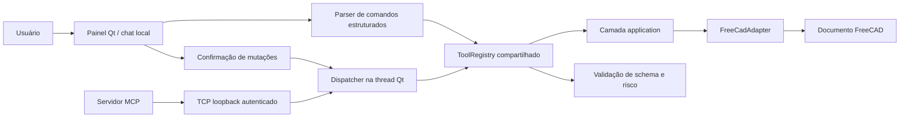

# AI CAD Workbench — plano de marcos e transferência

Este documento é o ponto de retomada do projeto em outro computador ou em outro
chat. Ele registra o estado funcional, as decisões que não podem ser perdidas, o
roteiro de desenvolvimento e os critérios de aceite de cada etapa.

O detalhamento mais recente do M3 e da ordem técnica do M4 está em
`docs/ai-agent-optimization-plan.md`. Esse plano acrescenta métricas, contexto
versionado, seleção de ferramentas, loop controlado, aprovação por plano e
rollback composto sem alterar as regras ou os marcos já concluídos.

## 1. Snapshot da transferência

- **Data:** 14 de julho de 2026.
- **Repositório privado:** `https://github.com/NoobDetonator/ai-cad-agents`.
- **Branch de trabalho:** `main`.
- **Baseline funcional desta revisão:** `971df80` — `Add transactional cylinder tool`.
- **Diretório usado no computador do trabalho:**
  `C:\Users\HRBASSIST55\Downloads\Ai-Cad Agents`.
- **Ambiente validado:** Windows, FreeCAD portátil 1.1.1 e Python 3.11 fornecido
  pelo próprio pacote do FreeCAD.
- **Última validação completa:** 94 testes unitários, `FREECAD_SMOKE_OK` e
  `FREECAD_GUI_SMOKE_OK`, incluindo o fluxo MCP gráfico.

O caminho local pode ser diferente no computador de casa. Nenhum código deve
depender do caminho absoluto acima; os scripts calculam a raiz do projeto.

## 2. Regras obrigatórias do projeto

Estas regras têm precedência sobre conveniências de implementação:

1. O FreeCAD é um adaptador. Regras de produto e schemas não dependem dele.
2. O chat interno e o MCP usam o mesmo `ToolRegistry`.
3. Toda mutação CAD é transacional, validada e reversível.
4. Não existe e não deve ser criada ferramenta de execução arbitrária de Python.
5. Chaves, tokens e credenciais nunca são gravados em arquivos do projeto.
6. Código importável fora do FreeCAD continua testável sem FreeCAD instalado.
7. `scripts/testar.ps1` é executado antes de concluir qualquer alteração.
8. `.venv`, `.tools`, `.downloads`, `.runtime`, arquivos CAD gerados e segredos
   permanecem fora do Git.
9. Mutações iniciadas por IA ou MCP precisam de confirmação explícita do usuário.
10. Um marco só está concluído quando código, testes e documentação concordam.

## 3. O que funciona agora

### Workbench e interface

- O Workbench aparece como **AI CAD** na lista do FreeCAD.
- Ao ativá-lo, o painel lateral de chat abre à direita.
- O lançador preserva corretamente caminhos do Windows que contêm espaços.
- O painel inicia no modo local; a DeepSeek só participa quando a opção visível
  é marcada pelo usuário.

### Chat local determinístico

O modo padrão continua sem modelo e reconhece um vocabulário local fechado:

```text
resumo
seleção
validar
caixa 10 x 20 x 30 nome MinhaCaixa
cilindro 30 x 60 nome Eixo
desfazer
```

- Leituras são executadas imediatamente.
- `caixa`, `cilindro` e `desfazer` apresentam um plano e aguardam o botão
  **Confirmar operação**.
- Um pedido desconhecido mostra ajuda e não é interpretado como código.
- Entradas, nomes e dimensões passam pela validação central do registro.

### Mutações CAD

A criação de caixa e cilindro:

1. valida dimensões finitas e positivas;
2. valida o nome do objeto;
3. habilita a pilha de desfazer quando necessário;
4. abre uma transação nomeada;
5. cria e recalcula o objeto;
6. valida forma e documento dentro da transação;
7. confirma em caso de sucesso;
8. aborta e recalcula em caso de falha.

O teste de integração comprova volume, transações independentes e que
`undo` remove cada objeto na ordem correta.

### MCP

- O servidor MCP importa a mesma instância de registro usada pela interface em
  cada processo.
- O MCP publica a lista de ferramentas do registro.
- Leituras chegam ao documento gráfico por uma ponte local autenticada.
- `request_cad_tool` aceita qualquer ferramenta registrada, mas mutações retornam
  `pending_confirmation` até o usuário decidir no painel.
- A fila e o timer do Qt garantem que o transporte nunca chame FreeCAD por uma
  worker thread.
- IDs repetidos com o mesmo conteúdo funcionam como polling idempotente.

## 4. Arquitetura atual



### Responsabilidades por arquivo

| Área | Arquivo principal | Responsabilidade |
| --- | --- | --- |
| Catálogo e política | `src/aicad/core/tool_registry.py` | Specs, schemas, validação, risco e confirmação |
| Comandos locais | `src/aicad/core/chat_commands.py` | Texto fechado para chamadas estruturadas e apresentação |
| Composição | `src/aicad/application.py` | Liga specs aos métodos de um adaptador CAD abstrato |
| Instância compartilhada | `src/aicad/runtime.py` | Fornece o registro usado por chat e MCP |
| Adaptador | `src/aicad/adapters/freecad_adapter.py` | Único limite para leitura e mutação do FreeCAD |
| Interface | `src/aicad/ui/chat_panel.py` | Painel, histórico, confirmação e interação Qt |
| Ponte local | `src/aicad/bridge/` | Protocolo, sessão, transporte e dispatcher |
| Controlador Qt | `src/aicad/ui/bridge_controller.py` | Ciclo de vida e transferência para a thread GUI |
| MCP | `src/aicad/mcp_server.py` | Catálogo e chamadas remotas controladas |
| Orquestração | `src/aicad/orchestration/` | Contratos neutros e planejamento validado sem execução |
| Workbench | `src/freecad/AiCad/InitGui.py` | Registro e ativação do Workbench |
| Testes | `scripts/testar.ps1` | Testes unitários, FreeCADCmd e GUI real |

### Ferramentas registradas

| Ferramenta | Risco | Estado atual |
| --- | --- | --- |
| `cad.get_document_summary` | `read` | Funciona dentro do FreeCAD |
| `cad.get_selection` | `read` | Funciona dentro da GUI do FreeCAD |
| `cad.get_context_snapshot` | `read` | L0/L1 versionado, limitado e paginado |
| `cad.create_box` | `modify` | Funciona com confirmação e transação |
| `cad.create_cylinder` | `modify` | Diâmetro × altura, eixo Z, confirmação e undo |
| `cad.validate_document` | `read` | Funciona e recalcula o documento |
| `cad.undo` | `modify` | Funciona com confirmação |

## 5. Resumo dos marcos

| Marco | Estado | Objetivo |
| --- | --- | --- |
| M0 — Fundação | Concluído | Estrutura, Workbench, adaptador, registro e testes iniciais |
| M1 — Chat local seguro | Concluído | Painel funcional, caixa transacional, confirmação e registro compartilhado |
| M2 — Ponte MCP–GUI | Concluído | Comunicação local segura e execução na thread Qt |
| M3 — Orquestrador de IA | Em andamento | Contexto, seleção de ferramentas e loop seguro e mensurável |
| M4 — Modelagem mecânica básica | Em andamento | Ferramentas priorizadas pelo benchmark e receitas seguras |
| M5 — Histórico e auditoria | Planejado | Registro persistente de planos, confirmações e resultados |
| M6 — Validação e exportação | Planejado | Regras de fabricação e exportações controladas |
| M7 — Empacotamento e experiência | Planejado | Instalação, atualização e uso diário mais simples |

## 6. M0 — Fundação — concluído

Commit de referência: `0c76e9b` — `Initial AI CAD workbench foundation`.

Entregas:

- estrutura Python importável;
- esqueleto do Workbench;
- painel demonstrativo;
- primeiro `ToolRegistry`;
- `FreeCadAdapter` inicial;
- servidor MCP de diagnóstico;
- setup isolado para Windows;
- testes unitários e smoke test no FreeCADCmd.

## 7. M1 — Chat local seguro — concluído

Commit de referência: `f90fa66` — `Add safe functional chat milestone`.

Entregas:

- correção do caminho de carregamento do Workbench;
- correção de argumentos com espaços no lançador;
- teste gráfico que abre e fecha o FreeCAD automaticamente;
- chat local com comandos estruturados;
- confirmação visual de ferramentas `modify`;
- validação de argumentos no `ToolRegistry`;
- bindings únicos entre catálogo e adaptador;
- registro compartilhado entre UI e MCP;
- criação de caixa validada e realmente reversível;
- bloqueio explícito de mutações via MCP;
- documentação de arquitetura e segurança atualizada.

## 8. M2 — Ponte local MCP–GUI — concluído

### Entregas

- Protocolo `1.0` tipado e independente de FreeCAD, Qt e MCP.
- Validação de toda request pelo mesmo `ToolRegistry`.
- TCP restrito ao loopback, autenticado, limitado e com timeout.
- Descoberta atômica da sessão no runtime local do usuário.
- Dispatcher com fila única, thread dona, idempotência e expiração.
- Controlador Qt responsável pelo servidor, timer e encerramento limpo.
- Mutações pendentes e apresentadas uma por vez no painel.
- Ferramenta MCP genérica para leitura, mutação e polling por request ID.
- Smoke gráfico cobrindo leitura, confirmação, criação única e undo.

### Objetivo

Permitir que o processo MCP converse com o documento aberto no FreeCAD sem criar
um segundo caminho de execução, sem acessar a API do FreeCAD fora da thread
principal do Qt e sem contornar a confirmação de mutações.

### Ordem recomendada de implementação

1. **Definir o protocolo independente do transporte.**
   - Criar modelos de request, response e erro fora do adaptador FreeCAD.
   - Campos mínimos: `request_id`, `tool_name`, `arguments`, `source` e versão do
     protocolo.
   - Respostas carregam resultado estruturado ou erro categorizado.
   - Não aceitar código, expressões ou nomes de funções fora do registro.

2. **Escolher e prototipar um transporte local.**
   - Avaliar named pipe do Windows e TCP somente em loopback.
   - Preferir o mecanismo que permita autenticação local, timeout e encerramento
     limpo sem dependência pesada.
   - Nunca escutar em interfaces de rede externas.
   - Usar uma capacidade aleatória no runtime local do usuário, com permissões
     restritas; nunca gravá-la no repositório ou em logs.

3. **Criar o dispatcher na GUI.**
   - A ponte pertence ao processo do FreeCAD.
   - Requests recebidos entram em uma fila única.
   - Um signal/slot ou timer do Qt transfere a execução para a thread principal.
   - O dispatcher resolve a ferramenta exclusivamente pelo `ToolRegistry`.

4. **Separar leitura de mutação.**
   - Ferramentas `read` podem ser executadas conforme a política local.
   - Ferramentas `modify` e `export` criam um pedido pendente no painel.
   - O MCP recebe estado `pending_confirmation` enquanto aguarda.
   - Somente o clique do usuário produz a autorização usada pelo registro.

5. **Implementar cancelamento, timeout e fila.**
   - Uma mutação por vez.
   - Cancelar ao fechar documento, painel ou FreeCAD.
   - Requests expirados nunca podem executar depois do timeout.
   - Respostas duplicadas e IDs repetidos devem ser rejeitados ou tratados de
     forma idempotente.

6. **Conectar o MCP à ponte.**
   - `available_cad_tools` continua vindo do registro.
   - Chamadas MCP são convertidas no envelope do protocolo.
   - O servidor não importa FreeCAD nem Qt.
   - Erros de conexão são claros e não iniciam instalações automaticamente.

7. **Preparar observabilidade local.**
   - As respostas estruturadas preservam request ID, estado, resultado ou erro.
   - A auditoria persistente de ferramenta, risco e decisão fica para o M5.
   - Tokens de sessão e conteúdo sensível não entram em logs nem em arquivos do
     repositório.

### Testes necessários para M2

- serialização e rejeição de envelopes inválidos;
- autenticação local incorreta é rejeitada;
- MCP lista exatamente as specs do registro;
- leitura do resumo funciona com a GUI aberta;
- leitura sem GUI retorna erro controlado;
- `cad.create_box` via MCP fica pendente até confirmação visual;
- cancelar não altera o documento;
- confirmar cria uma única caixa validada e reversível;
- timeout impede execução tardia;
- duas requests concorrentes respeitam a fila;
- o servidor MCP continua importável sem FreeCAD;
- suíte gráfica continua fechando o processo de teste.

### Critério de aceite de M2

Critério atendido: com o FreeCAD aberto, o cliente lê o documento e solicita uma
caixa; ela só aparece após confirmação no painel, pode ser desfeita e toda a
suíte passa. Não existe endpoint externo, Python arbitrário ou atalho direto ao
adaptador.

## 9. M3 — Orquestrador de IA — em andamento

Plano detalhado de execução: `docs/ai-agent-optimization-plan.md`.

### Dependência

Começar somente depois de M2 estar estável. O modelo deve usar a mesma trilha de
ferramentas e confirmação já exercitada pelo MCP.

### Progresso atual

- Contratos tipados de request, response, ferramentas e plano independentes de SDK.
- Interface `AiProvider` definida como `Protocol` síncrono e substituível.
- Conversão de `ToolSpec` preserva schema e risco sem depender do provedor.
- `AiOrchestrator` envia somente contexto JSON limitado e ferramentas permitidas.
- Chamadas propostas são revalidadas pelo `ToolRegistry` e nunca executadas no plano.
- Limites de mensagem, contexto, ferramentas e chamadas são aplicados localmente.
- `CredentialStore` usa `keyring` e retorna segredos protegidos por `SecretStr`.
- O painel permite configurar, substituir e remover a chave DeepSeek sem exibi-la.
- Testes cobrem planejamento, isolamento, credenciais, tradução de ferramentas,
  erros e limites.
- O adaptador DeepSeek e a ativação opcional no painel foram implementados
  sem bloquear a thread Qt.
- Uma rodada propõe no máximo uma ferramenta; leituras executam e mutações
  aguardam confirmação.
- O loop iterativo com retorno de resultados ao modelo ainda não foi implementado.
- M3.1 concluído com `ToolResultEnvelope`, erros categorizados, eventos monotônicos,
  corpus de 30 pedidos e runner offline sem FreeCAD, rede ou credencial.
- Baseline local: 14/20 ferramentas exatas, 0/5 esclarecimentos explícitos,
  0/5 rejeições explicativas e bloqueio seguro dos 10 casos sem ferramenta.
- M3.2 concluído com `DocumentStateToken`, `ContextSnapshot` L0/L1, seleção,
  objetos recentes, parâmetros, forma, limites e paginação.
- DeepSeek e MCP recebem o contexto pela mesma ferramenta registrada; mudança
  manual relevante altera a revisão sem executar mutação.

### M3.1 — Medição e contratos — concluído

- `src/aicad/core/tool_results.py` define resultado, erro, objetos afetados e
  validações com limites e invariantes.
- `src/aicad/orchestration/metrics.py` mede etapas somente em memória e rejeita
  metadados sensíveis.
- `benchmarks/agent-corpus-v1.json` registra 30 casos em português.
- `scripts/benchmark_agent.ps1` executa a baseline reproduzível.
- Os contratos ainda não substituem os resultados atuais do painel; a migração
  será feita pelo controlador do loop em uma etapa posterior.

### M3.2 — Contexto versionado — concluído

- Modelos e rastreador ficam em `aicad.core.context`, fora do FreeCAD.
- `FreeCadAdapter` produz L0/L1 sem recomputar intencionalmente o documento.
- Fingerprints cobrem identidade, parâmetros, placement, forma e seleção.
- O comando local `contexto` apresenta revisão, contagens e objetos recentes.
- O painel DeepSeek envia o snapshot limitado em vez do resumo simples.
- MCP lista e executa a leitura pelo registro e pela ponte já autenticada.
- FreeCADCmd comprova estabilidade do token e detecção de alteração manual.
- Smoke gráfico comprova leitura MCP e apresentação visual com seleção.

### Passos

1. Manter a interface de provedor independente de qualquer SDK específico.
2. Converter `ToolSpec` para o formato de ferramentas do provedor.
3. Enviar ao modelo somente contexto necessário e specs permitidas.
4. Tratar respostas textuais, chamadas de ferramenta e erros de forma explícita.
5. Mostrar intenção, suposições e plano antes de qualquer mutação.
6. Passar toda chamada pelo `ToolRegistry`; nunca executar texto retornado.
7. Limitar número de iterações, tempo e volume de chamadas.
8. Permitir cancelar a execução pelo painel.
9. Adicionar uma configuração de provedor sem acoplar schemas ao provedor.
10. Configurar a chave somente por ação explícita do usuário no painel.

### Credenciais

- Usar `keyring` com o cofre de credenciais do Windows.
- Salvar identificadores no cofre e nunca gravar o segredo em arquivos do projeto.
- Não usar `.env` como solução de produção.
- Não imprimir a chave em logs, mensagens de erro ou testes.
- Oferecer ação explícita para substituir ou remover a credencial.

### Critério de aceite de M3

Um pedido em linguagem natural produz um plano verificável e chamadas de
ferramenta estruturadas. Leituras podem prosseguir; mutações aguardam confirmação.
Desligar o provedor não quebra o chat local nem o MCP.

## 10. M4 — Modelagem mecânica básica

Adicionar uma ferramenta por vez, sempre com schema, validação, transação, undo,
teste fora do FreeCAD quando possível e teste de integração dentro dele.

### Progresso atual

- `cad.create_cylinder` concluída com diâmetro, altura, eixo Z, confirmação,
  validação de volume e undo independente.
- O mesmo helper transacional atende caixa e cilindro e aborta em falhas.
- Chat local, DeepSeek e MCP recebem a ferramenta pelo registro compartilhado.

Ordem restante:

1. placa com dimensões e espessura;
2. criação de sketch retangular simples;
3. extrusão/pad controlado;
4. furo cilíndrico passante;
5. padrões de furos simples;
6. chanfro e filete com seleção explícita;
7. renomear e alterar parâmetros existentes;
8. consulta de medidas e bounding box;
9. operações booleanas com validação de operandos.

Para operações baseadas em faces ou arestas, não confiar apenas em índices
topológicos instáveis. Registrar referências, contexto e estratégia de resolução.

### Critério de aceite de M4

É possível construir, revisar e editar peças mecânicas simples sem gerar objetos
inválidos silenciosamente. Cada operação pode ser desfeita e tem cobertura de
falha, não apenas de sucesso.

## 11. M5 — Histórico e auditoria

Entregas planejadas:

- ID de sessão e ID por ação;
- texto do usuário, suposições e plano;
- ferramenta, argumentos validados e risco;
- decisão de confirmação ou cancelamento;
- resultado, duração e validações;
- vínculo com transações do FreeCAD;
- exportação do histórico sem segredos;
- armazenamento local versionado por schema e fora do Git.

O histórico deve ser útil para explicar e reproduzir decisões, mas não deve
capturar credenciais ou dados desnecessários.

## 12. M6 — Validação e exportação

Ordem sugerida:

1. validação dimensional e de forma;
2. checagens configuráveis para impressão 3D;
3. prévia do arquivo a exportar;
4. exportação STL;
5. exportação STEP;
6. confirmação explícita de destino e sobrescrita;
7. checksum, tamanho e resumo do artefato;
8. testes com diretórios temporários.

Ferramentas de exportação usam risco `export`, não escrevem fora do destino
escolhido e nunca sobrescrevem silenciosamente.

## 13. M7 — Empacotamento e experiência

Itens planejados:

- instalação do Workbench sem caminho manual;
- diagnóstico de versão do FreeCAD e dependências;
- atualização segura e reversível;
- mensagens de erro em português claro;
- preferências de tema, painel e provedor;
- documentação para usuário final;
- testes em instalação limpa;
- estratégia de release e versão.

Não empacotar FreeCAD novamente sem necessidade. Separar claramente o código do
Workbench dos artefatos grandes de desenvolvimento.

## 14. Preparação do computador de casa

### Clonar e conferir

```powershell
git clone https://github.com/NoobDetonator/ai-cad-agents.git
cd ai-cad-agents
git status
git log -3 --oneline
```

Confirmar que a branch é `main`, que não há mudanças locais inesperadas e que o
commit `971df80` ou um commit posterior está presente.

### Ler antes de alterar

Ler integralmente:

1. `AGENTS.md`;
2. `README.md`;
3. `docs/architecture.md`;
4. `docs/product-vision.md`;
5. este `docs/milestones.md`;
6. `docs/ai-agent-optimization-plan.md`.

### Preparar o ambiente novo

As pastas grandes e locais não vêm pelo Git. Em um computador novo, executar uma
única vez:

```powershell
powershell.exe -NoProfile -ExecutionPolicy Bypass -File .\scripts\setup.ps1
```

O setup cria `.downloads`, `.tools`, `.runtime` e `.venv`, baixa o FreeCAD
portátil oficial quando ele ainda não existe, verifica o pacote quando há checksum
e instala as dependências Python isoladas. Não copiar esses diretórios para o Git.

Se o FreeCAD e o ambiente já tiverem sido preparados naquela máquina, não rodar o
setup novamente sem um motivo concreto.

### Validar a base

```powershell
powershell.exe -NoProfile -ExecutionPolicy Bypass -File .\scripts\testar.ps1
```

Resultado esperado:

- 94 testes Python aprovados ou quantidade superior;
- `FREECAD_SMOKE_OK`;
- `FREECAD_GUI_SMOKE_OK`;
- janela gráfica abre e fecha automaticamente;
- captura local em `.runtime\gui-smoke-panel.png`.

### Abrir para uso manual

```powershell
powershell.exe -NoProfile -ExecutionPolicy Bypass -File .\scripts\iniciar.ps1
```

Selecionar **AI CAD**, confirmar o painel lateral e testar primeiro `resumo` e
uma caixa pequena. Não usar documentos importantes para o primeiro teste manual.

## 15. Checklist para qualquer sessão de desenvolvimento

### Antes de editar

- ler `AGENTS.md` e os documentos relevantes;
- executar `git status --short --branch`;
- preservar mudanças locais existentes;
- confirmar o commit e a branch;
- executar a suíte inicial;
- reproduzir visualmente problemas de GUI quando aplicável.

### Durante a implementação

- manter regras e schemas fora do FreeCAD;
- usar o registro compartilhado;
- validar antes de chamar o handler;
- exigir confirmação conforme o risco;
- envolver mutações em transação;
- recalcular e validar antes do commit da transação;
- abortar em toda falha;
- criar teste de reversibilidade;
- não adicionar execução genérica de Python;
- não solicitar chave antes da etapa de provedor.

### Antes de concluir

- revisar `git diff` e `git diff --check`;
- procurar segredos e arquivos grandes;
- atualizar documentação e este plano se o estado mudou;
- executar `scripts/testar.ps1` completo;
- verificar que `.runtime`, `.tools`, `.downloads` e `.venv` não estão staged;
- criar commit com mensagem que represente um marco coerente;
- atualizar a referência remota antes do push;
- fazer push somente com o worktree revisado.

## 16. Limitações e riscos conhecidos

- O parser atual não entende linguagem natural aberta.
- As mutações geométricas atuais criam somente caixa e cilindro isolados.
- Chamadas MCP ao documento dependem de uma sessão gráfica do FreeCAD ativa.
- `cad.validate_document` recalcula, embora seja classificado como leitura por não
  alterar intencionalmente a geometria.
- `undo` atua sobre a última transação disponível; uma evolução futura deve
  registrar e apresentar claramente a origem da transação.
- A suíte gráfica depende de uma sessão Windows capaz de abrir GUI.
- A seleção topológica do FreeCAD pode ser instável após mudanças paramétricas;
  operações futuras precisam tratar esse problema explicitamente.
- Não há persistência de conversas ou auditoria estruturada ainda.
- O modo DeepSeek realiza uma única rodada; ainda não devolve resultados de
  ferramentas ao modelo.

## 17. Decisões técnicas

### Definidas no M2

1. **Protocolo local:** versão inicial `1.0`, com envelopes JSON tipados,
   request ID, ferramenta, argumentos, origem, resultado ou erro categorizado.
2. **Transporte:** TCP em loopback IPv4, host padrão `127.0.0.1`, porta efêmera,
   token aleatório por sessão, framing com tamanho, limite e timeout.
3. **Limite de thread:** o transporte não acessa FreeCAD. O controlador da GUI
   enfileira toda execução para a thread principal do Qt.

### Pendentes

1. Política de aprovação para leituras potencialmente caras.
2. Persistência e retenção do histórico de auditoria.
3. Política de loop iterativo e troca futura entre provedores.
4. Estratégia para referências topológicas robustas.
5. Ordem exata das ferramentas mecânicas após caixa e cilindro.
6. Formato de distribuição do Workbench para usuários não desenvolvedores.

As escolhas pendentes devem ser registradas antes de se tornarem dependências
difíceis de reverter.

## 18. Prompt de retomada para outro chat

Copiar o texto abaixo para iniciar a próxima sessão:

```text
Quero continuar o projeto AI CAD Workbench do repositório privado
https://github.com/NoobDetonator/ai-cad-agents.

Antes de alterar qualquer coisa, leia integralmente AGENTS.md, README.md e todos
os arquivos da pasta docs, com atenção especial a docs/milestones.md e
docs/ai-agent-optimization-plan.md. Verifique o Git, preserve mudanças existentes
e execute scripts/testar.ps1 para confirmar a base.

O baseline desta revisão é 971df80 ou um commit posterior. Na árvore atual, o
Workbench, o chat local seguro, caixa e cilindro transacionais, undo, ToolRegistry
compartilhado, ponte MCP–GUI autenticada e planejamento opcional com DeepSeek já
funcionam e estão testados. M3.1 e M3.2 também possuem contratos estruturados,
métricas, benchmark offline e contexto versionado compartilhado. A DeepSeek ainda
usa uma rodada e uma ferramenta. O próximo marco recomendado é M3.3 em
docs/ai-agent-optimization-plan.md: enriquecer ToolSpec e criar seleção local
top-N PT/EN sem habilitar novas mutações.

Mantenha o FreeCAD como adaptador, não crie execução arbitrária de Python, não
salve credenciais no projeto e faça toda mutação de forma transacional, validada
e reversível. Trabalhe de forma autônoma, atualize os testes e a documentação e
só faça commit/push quando um marco coerente estiver testado.
```

## 19. Definição geral de pronto

Uma etapa está pronta somente quando:

- resolve um objetivo de produto demonstrável;
- mantém uma única trilha de ferramentas para chat e MCP;
- não introduz execução arbitrária;
- valida inputs e outputs relevantes;
- toda mutação é confirmada, transacional e reversível;
- código de núcleo continua testável sem FreeCAD;
- testes unitários e integrações relevantes passam;
- o Workbench é verificado visualmente quando a UI muda;
- documentação reflete o comportamento real;
- nenhum segredo ou artefato pesado entra no Git;
- o commit está publicado e a branch remota está sincronizada.
