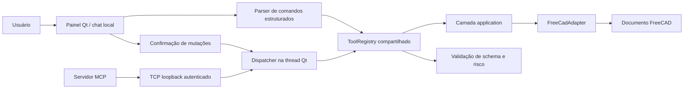

# AI CAD Workbench — plano de marcos e transferência

Este documento é o ponto de retomada do projeto em outro computador ou em outro
chat. Ele registra o estado funcional, as decisões que não podem ser perdidas, o
roteiro de desenvolvimento e os critérios de aceite de cada etapa.

O detalhamento mais recente do M3 e da execução do M4 está em
`docs/ai-agent-optimization-plan.md`. Esse plano acrescenta métricas, contexto
versionado, seleção de ferramentas, loop controlado, aprovação por plano e
rollback composto sem alterar as regras ou os marcos já concluídos.

## Decisão estratégica de 14 de julho de 2026 — MCP primeiro

O produto principal é o **servidor MCP consumido por agentes externos**
(Claude Code, Codex, Cursor e qualquer cliente MCP). O agente externo é a IA;
o usuário escolhe a plataforma ao escolher o agente. Consequências para os
marcos:

1. **Não será construído suporte multi-provedor interno.** A decisão pendente
   "política para troca futura entre provedores" está resolvida: o provedor é
   trazido pelo agente externo. O contrato neutro `AiProvider` permanece como
   está para o modo standalone.
2. **A IA embutida (DeepSeek, `ToolSelector`, `AgentTurnController`) entra em
   modo manutenção.** Continua funcionando, testada e coberta pela suíte, mas
   não recebe novas funcionalidades. Bugs são corrigidos; features não são
   adicionadas.
3. **O painel evolui como superfície de aprovação e visualização** das ações
   solicitadas pelo agente externo, não como chat concorrente.
4. **Horas novas vão para a superfície que o agente toca:** exportação,
   ferramentas de modelagem, feedback visual e documentação de integração.

Os marcos M6 e M7 abaixo refletem essa decisão. Nada dos marcos M0–M5 é
descartado: registro, ponte, transações, planos, auditoria e receitas são
exatamente a infraestrutura que o produto MCP usa.

## 1. Snapshot da transferência

- **Data:** 15 de julho de 2026.
- **Repositório privado:** `https://github.com/NoobDetonator/ai-cad-agents`.
- **Branch de trabalho:** `main`.
- **Baseline anterior ao M4:** `700836e` — `Expose reversible plans through MCP`.
- **Baseline recomendada:** o commit que contém este documento ou um posterior.
- **Diretório usado no computador do trabalho:**
  `C:\Users\HRBASSIST55\Downloads\Ai-Cad Agents`.
- **Ambiente validado:** Windows, FreeCAD 1.1.1 instalado em
  `C:\Program Files\FreeCAD 1.1` e Python 3.11 fornecido pelo FreeCAD.
- **Última validação completa:** 198 testes unitários, `FREECAD_SMOKE_OK`,
  `FREECAD_FOUNDATION_SMOKE_OK`, `FREECAD_ASSEMBLY_SMOKE_OK`,
  `FREECAD_BEARINGS_SMOKE_OK`,
  `FREECAD_M4_SMOKE_OK`, `FREECAD_M6_SMOKE_OK`, `FREECAD_M7_SMOKE_OK` e
  `FREECAD_GUI_SMOKE_OK`, incluindo modelagem, documentos, exportação, receitas,
  fluxo MCP gráfico e captura visual.

O caminho local pode ser diferente no computador de casa. Nenhum código deve
depender do caminho absoluto acima; os scripts calculam a raiz do projeto.

## 2. Regras obrigatórias do projeto

Estas regras têm precedência sobre conveniências de implementação:

1. O FreeCAD é um adaptador. Regras de produto e schemas não dependem dele.
2. O chat interno e o MCP usam o mesmo `ToolRegistry`.
3. Toda mutação CAD é transacional, validada e reversível.
4. Não existe e não deve ser criada ferramenta de execução arbitrária de Python.
5. Chaves, tokens e credenciais nunca são gravados em arquivos do projeto.
6. Código importável fora do FreeCAD continua testável sem FreeCAD instalado.
7. `scripts/testar.ps1` é executado antes de concluir qualquer alteração.
8. `.venv`, `.tools`, `.downloads`, `.runtime`, arquivos CAD gerados e segredos
   permanecem fora do Git.
9. Mutações iniciadas por IA ou MCP precisam de um `ApprovalGrant` exato emitido
   pelo painel. A emissão pode ser automática quando a opção visível estiver
   marcada; exportações continuam exigindo clique.
10. Um marco só está concluído quando código, testes e documentação concordam.

## 3. O que funciona agora

### Workbench e interface

- O Workbench aparece como **AI CAD** na lista do FreeCAD.
- Ao ativá-lo, o painel lateral de chat abre à direita.
- O Workbench pode ser vinculado ao diretório `Mod` do usuário e aberto pelo
  FreeCAD instalado, sem script de inicialização.
- O painel inicia no modo local; a DeepSeek só participa quando a opção visível
  é marcada pelo usuário.
- O painel inicia com aceitação automática visível para mutações; a opção pode
  ser desmarcada para exigir confirmação manual. Exportações permanecem manuais.
- `scripts/iniciar_rapido.ps1` permanece como auxiliar de desenvolvimento.

### Chat local determinístico

O modo padrão continua sem modelo e reconhece um vocabulário local fechado:

```text
resumo
seleção
contexto
detalhes Base
medir Base
dependências Base
parâmetros Base
validar
caixa 10 x 20 x 30 nome MinhaCaixa
cilindro 30 x 60 nome Eixo
placa 100 x 60 x 8 nome Base
desfazer
```

- Leituras são executadas imediatamente.
- `caixa`, `cilindro`, `placa` e `desfazer` apresentam um plano e aguardam o botão
  **Confirmar operação**.
- Um pedido desconhecido mostra ajuda e não é interpretado como código.
- Entradas, nomes e dimensões passam pela validação central do registro.

### Mutações CAD

As mutações registradas:

1. valida dimensões finitas e positivas;
2. valida o nome do objeto;
3. habilita a pilha de desfazer quando necessário;
4. abre uma transação nomeada;
5. criam ou editam e recalculam o objeto;
6. valida forma e documento dentro da transação;
7. confirma em caso de sucesso;
8. aborta e recalcula em caso de falha.

O teste de integração comprova propriedades, volume, medidas, dependências,
falhas abortadas e que `undo` restaura o fingerprint anterior. O M4 cobre placa,
furos e padrões, sketch/pad, transformação, parâmetros, booleanas, filete e
chanfro, além das primitivas anteriores.

### MCP

- O servidor MCP importa a mesma instância de registro usada pela interface em
  cada processo.
- O MCP publica a lista de ferramentas do registro.
- Leituras chegam ao documento gráfico por uma ponte local autenticada.
- `request_cad_tool` aceita qualquer ferramenta registrada, mas mutações retornam
  `pending_confirmation` até o usuário decidir no painel.
- A fila e o timer do Qt garantem que o transporte nunca chame FreeCAD por uma
  worker thread.
- IDs repetidos com o mesmo conteúdo funcionam como polling idempotente.
- O MCP lista e submete receitas pelo mesmo `PlanService`.
- Prompts e Resources expõem receitas e capturas por ID opaco, nunca por caminho.

## 4. Arquitetura atual



### Responsabilidades por arquivo

| Área | Arquivo principal | Responsabilidade |
| --- | --- | --- |
| Política do registro | `src/aicad/core/tool_registry.py` | Contratos, validação, risco, confirmação e execução |
| Catálogo por domínio | `src/aicad/core/tool_catalog/` | Specs e schemas neutros agregados em ordem pública estável |
| Comandos locais | `src/aicad/core/chat_commands.py` | Texto fechado para chamadas estruturadas e apresentação |
| Composição | `src/aicad/application.py` | Liga specs aos métodos de um adaptador CAD abstrato |
| Instância compartilhada | `src/aicad/runtime.py` | Fornece o registro usado por chat e MCP |
| Adaptador | `src/aicad/adapters/freecad_adapter.py` | Único limite para leitura e mutação do FreeCAD |
| Interface | `src/aicad/ui/chat_panel.py` | Painel, histórico, confirmação e interação Qt |
| Ponte local | `src/aicad/bridge/` | Protocolo, sessão, transporte e dispatcher |
| Controlador Qt | `src/aicad/ui/bridge_controller.py` | Ciclo de vida e transferência para a thread GUI |
| MCP | `src/aicad/mcp_server.py` | Catálogo e chamadas remotas controladas |
| Orquestração | `src/aicad/orchestration/` | Contratos neutros e planejamento validado sem execução |
| Workbench | `src/freecad/AiCad/InitGui.py` | Registro e ativação do Workbench |
| Testes | `scripts/testar.ps1` | Testes unitários, FreeCADCmd e GUI real |

### Ferramentas registradas

| Grupo | Ferramentas | Risco | Estado atual |
| --- | --- | --- |
| Documento | `get_document_summary`, `get_selection`, `get_context_snapshot`, `validate_document`, `list_documents` | `read` | Testado |
| Ciclo de documento | `new_document`, `set_active_document`, `save_document` | `modify`/`export` | Validado e sem sobrescrita silenciosa |
| Objeto | `get_object_details`, `measure_object`, `get_dependencies`, `resolve_object`, `get_editable_parameters` | `read` | Testado |
| Visual | `capture_view` | `read` | PNG sob demanda e cache limitado |
| Primitivas | `create_box`, `create_cylinder`, `create_plate` | `modify` | Transacional e reversível |
| Edição | `rename_object`, `set_parameter`, `transform_object` | `modify` | Transacional e reversível |
| Furos | `create_through_hole`, `create_rectangular_hole_pattern`, `create_circular_hole_pattern`, `create_counterbore_hole`, `create_countersunk_hole`, `create_threaded_hole` | `modify` | BRep derivado e reversível |
| Construção | `create_rectangular_sketch`, `create_circular_sketch`, `pad_sketch`, `revolve_sketch`, `loft_sketches`, `create_sweep_path`, `sweep_sketch`, `boolean_operation` | `modify` | Fontes vinculadas e reversíveis |
| Acabamento | `fillet_edges`, `chamfer_edges` | `modify` | Assinatura geométrica de aresta |
| Padrões | `mirror_object`, `linear_pattern`, `polar_pattern` | `modify` | Feature derivada; pode conter sólidos desconectados |
| Mecânica | `create_spur_gear`, `create_helical_gear`, `create_external_thread` | `modify` | Involuta/rosca controladas, transacionais e reversíveis |
| Auditoria | `get_audit_history`, `export_audit_history` | `read`/`export` | Redaction e confirmação de exportação |
| Exportação CAD | `export_stl`, `export_step` | `export` | Documento validado antes, destino absoluto, sem sobrescrita silenciosa, checksum |
| Histórico CAD | `undo` | `modify` | Confirmação obrigatória |

## 5. Resumo dos marcos

| Marco | Estado | Objetivo |
| --- | --- | --- |
| M0 — Fundação | Concluído | Estrutura, Workbench, adaptador, registro e testes iniciais |
| M1 — Chat local seguro | Concluído | Painel funcional, caixa transacional, confirmação e registro compartilhado |
| M2 — Ponte MCP–GUI | Concluído | Comunicação local segura e execução na thread Qt |
| M3 — Orquestrador de IA | Concluído | Contexto, seleção, loop seguro e planos reversíveis via chat/MCP |
| M4 — Modelagem mecânica básica | Concluído | 18 capacidades mecânicas, receitas, seleção e visão |
| M5 — Histórico e auditoria | Concluído | Ações, planos, aprovações, transações e exportação auditáveis |
| M6 — MCP como produto | Concluído | Exportação STL/STEP, validação, integração com Claude Code/Codex/Cursor e fluxo pedido→arquivo de ponta a ponta |
| M7 — Cobertura de modelagem | Concluído | Documentos, revolução, loft, helicoidal, roscas externa/interna, furos com rebaixo/escareado/roscados, sweep, sketch constrangido, fase de dentes, espelho, padrões e receitas novas |

M0 a M7 formam a baseline concluída. Não há próximo marco automático; trabalho
novo entra como manutenção ou incremento explicitamente aprovado.

## 6. M0 — Fundação — concluído

Commit de referência: `0c76e9b` — `Initial AI CAD workbench foundation`.

Entregas:

- estrutura Python importável;
- esqueleto do Workbench;
- painel demonstrativo;
- primeiro `ToolRegistry`;
- `FreeCadAdapter` inicial;
- servidor MCP de diagnóstico;
- setup isolado para Windows;
- testes unitários e smoke test no FreeCADCmd.

## 7. M1 — Chat local seguro — concluído

Commit de referência: `f90fa66` — `Add safe functional chat milestone`.

Entregas:

- correção do caminho de carregamento do Workbench;
- correção de argumentos com espaços no lançador;
- teste gráfico que abre e fecha o FreeCAD automaticamente;
- chat local com comandos estruturados;
- confirmação visual de ferramentas `modify`;
- validação de argumentos no `ToolRegistry`;
- bindings únicos entre catálogo e adaptador;
- registro compartilhado entre UI e MCP;
- criação de caixa validada e realmente reversível;
- bloqueio explícito de mutações via MCP;
- documentação de arquitetura e segurança atualizada.

## 8. M2 — Ponte local MCP–GUI — concluído

### Entregas

- Protocolo `1.0` tipado e independente de FreeCAD, Qt e MCP.
- Validação de toda request pelo mesmo `ToolRegistry`.
- TCP restrito ao loopback, autenticado, limitado e com timeout.
- Descoberta atômica da sessão no runtime local do usuário.
- Dispatcher com fila única, thread dona, idempotência e expiração.
- Controlador Qt responsável pelo servidor, timer e encerramento limpo.
- Mutações pendentes e apresentadas uma por vez no painel.
- Ferramenta MCP genérica para leitura, mutação e polling por request ID.
- Smoke gráfico cobrindo leitura, confirmação, criação única e undo.

### Objetivo

Permitir que o processo MCP converse com o documento aberto no FreeCAD sem criar
um segundo caminho de execução, sem acessar a API do FreeCAD fora da thread
principal do Qt e sem contornar a confirmação de mutações.

### Ordem recomendada de implementação

1. **Definir o protocolo independente do transporte.**
   - Criar modelos de request, response e erro fora do adaptador FreeCAD.
   - Campos mínimos: `request_id`, `tool_name`, `arguments`, `source` e versão do
     protocolo.
   - Respostas carregam resultado estruturado ou erro categorizado.
   - Não aceitar código, expressões ou nomes de funções fora do registro.

2. **Escolher e prototipar um transporte local.**
   - Avaliar named pipe do Windows e TCP somente em loopback.
   - Preferir o mecanismo que permita autenticação local, timeout e encerramento
     limpo sem dependência pesada.
   - Nunca escutar em interfaces de rede externas.
   - Usar uma capacidade aleatória no runtime local do usuário, com permissões
     restritas; nunca gravá-la no repositório ou em logs.

3. **Criar o dispatcher na GUI.**
   - A ponte pertence ao processo do FreeCAD.
   - Requests recebidos entram em uma fila única.
   - Um signal/slot ou timer do Qt transfere a execução para a thread principal.
   - O dispatcher resolve a ferramenta exclusivamente pelo `ToolRegistry`.

4. **Separar leitura de mutação.**
   - Ferramentas `read` podem ser executadas conforme a política local.
   - Ferramentas `modify` e `export` criam um pedido pendente no painel.
   - O MCP recebe estado `pending_confirmation` enquanto aguarda.
   - Somente o clique do usuário produz a autorização usada pelo registro.

5. **Implementar cancelamento, timeout e fila.**
   - Uma mutação por vez.
   - Cancelar ao fechar documento, painel ou FreeCAD.
   - Requests expirados nunca podem executar depois do timeout.
   - Respostas duplicadas e IDs repetidos devem ser rejeitados ou tratados de
     forma idempotente.

6. **Conectar o MCP à ponte.**
   - `available_cad_tools` continua vindo do registro.
   - Chamadas MCP são convertidas no envelope do protocolo.
   - O servidor não importa FreeCAD nem Qt.
   - Erros de conexão são claros e não iniciam instalações automaticamente.

7. **Preparar observabilidade local.**
   - As respostas estruturadas preservam request ID, estado, resultado ou erro.
   - A auditoria persistente de ferramenta, risco e decisão fica para o M5.
   - Tokens de sessão e conteúdo sensível não entram em logs nem em arquivos do
     repositório.

### Testes necessários para M2

- serialização e rejeição de envelopes inválidos;
- autenticação local incorreta é rejeitada;
- MCP lista exatamente as specs do registro;
- leitura do resumo funciona com a GUI aberta;
- leitura sem GUI retorna erro controlado;
- `cad.create_box` via MCP fica pendente até confirmação visual;
- cancelar não altera o documento;
- confirmar cria uma única caixa validada e reversível;
- timeout impede execução tardia;
- duas requests concorrentes respeitam a fila;
- o servidor MCP continua importável sem FreeCAD;
- suíte gráfica continua fechando o processo de teste.

### Critério de aceite de M2

Critério atendido: com o FreeCAD aberto, o cliente lê o documento e solicita uma
caixa; ela só aparece após confirmação no painel, pode ser desfeita e toda a
suíte passa. Não existe endpoint externo, Python arbitrário ou atalho direto ao
adaptador.

## 9. M3 — Orquestrador de IA — concluído

Plano detalhado de execução: `docs/ai-agent-optimization-plan.md`.

### Dependência

Começar somente depois de M2 estar estável. O modelo deve usar a mesma trilha de
ferramentas e confirmação já exercitada pelo MCP.

### Progresso atual

- Contratos tipados de request, response, ferramentas e plano independentes de SDK.
- Interface `AiProvider` definida como `Protocol` síncrono e substituível.
- Conversão de `ToolSpec` preserva schema e risco sem depender do provedor.
- `AiOrchestrator` envia somente contexto JSON limitado e ferramentas permitidas.
- Chamadas propostas são revalidadas pelo `ToolRegistry` e nunca executadas no plano.
- Limites de mensagem, contexto, ferramentas e chamadas são aplicados localmente.
- `CredentialStore` usa `keyring` e retorna segredos protegidos por `SecretStr`.
- O painel permite configurar, substituir e remover a chave DeepSeek sem exibi-la.
- Testes cobrem planejamento, isolamento, credenciais, tradução de ferramentas,
  erros e limites.
- O adaptador DeepSeek e a ativação opcional no painel foram implementados
  sem bloquear a thread Qt.
- O loop faz até quatro rodadas e duas chamadas propostas por rodada; somente
  leituras executam automaticamente e mutações aguardam confirmação.
- O loop iterativo devolve resultados de leitura ao modelo e pode replanejar.
- M3.1 concluído com `ToolResultEnvelope`, erros categorizados, eventos monotônicos,
  corpus de 30 pedidos e runner offline sem FreeCAD, rede ou credencial.
- Baseline local: 14/20 ferramentas exatas, 0/5 esclarecimentos explícitos,
  0/5 rejeições explicativas e bloqueio seguro dos 10 casos sem ferramenta.
- M3.2 concluído com `DocumentStateToken`, `ContextSnapshot` L0/L1, seleção,
  objetos recentes, parâmetros, forma, limites e paginação.
- DeepSeek e MCP recebem o contexto pela mesma ferramenta registrada; mudança
  manual relevante altera a revisão sem executar mutação.
- M3.3 concluído com metadados no registro, seleção local PT/EN, top-N quatro e
  ordenação canônica antes da chamada DeepSeek.
- Benchmark do seletor: recall 20/20, mutações expostas 0/5 nos pedidos perigosos,
  média de 2,83 ferramentas e economia superior a 90% dos schemas no catálogo
  atual; o corpus mecânico alcança 30/30 e economia de 87,6%.
- M3.4 concluído com loop de leitura, histórico de ferramentas, cancelamento,
  progresso, memória em RAM e cliente HTTP reutilizado durante o turno.
- M3.5 concluído com plano imutável, hash canônico, autorização exata, recusa de
  estado obsoleto e pós-condição em uma única mutação.
- M3.6 concluído com plano composto no chat e no MCP, pré-validação, aprovação
  única, status/cancelamento idempotentes e rollback compensatório verificado.

### M3.1 — Medição e contratos — concluído

- `src/aicad/core/tool_results.py` define resultado, erro, objetos afetados e
  validações com limites e invariantes.
- `src/aicad/orchestration/metrics.py` mede etapas somente em memória e rejeita
  metadados sensíveis.
- `benchmarks/agent-corpus-v1.json` registra 30 casos em português.
- `scripts/benchmark_agent.ps1` executa a baseline reproduzível.
- Os contratos são usados pelo controlador do loop e pela apresentação do painel.

### M3.2 — Contexto versionado — concluído

- Modelos e rastreador ficam em `aicad.core.context`, fora do FreeCAD.
- `FreeCadAdapter` produz L0/L1 sem recomputar intencionalmente o documento.
- Fingerprints cobrem identidade, parâmetros, placement, forma e seleção.
- O comando local `contexto` apresenta revisão, contagens e objetos recentes.
- O painel DeepSeek envia o snapshot limitado em vez do resumo simples.
- MCP lista e executa a leitura pelo registro e pela ponte já autenticada.
- FreeCADCmd comprova estabilidade do token e detecção de alteração manual.
- Smoke gráfico comprova leitura MCP e apresentação visual com seleção.

### M3.3 — Recuperação de ferramentas — concluído

- `ToolSpec` contém família, aliases, tags, exemplos, essencialidade e ordem.
- `ToolSelector` normaliza português/inglês e pontua cada ferramenta localmente.
- O subconjunto tem até quatro ferramentas, mantém contexto essencial e sai em
  ordem canônica estável para favorecer cache do provedor.
- Baixa confiança usa fallback somente leitura; pedidos perigosos nunca recebem
  ferramentas `modify`.
- `AiOrchestrator` usa o seletor automaticamente quando o chamador não fornece
  uma allowlist explícita.
- `scripts/benchmark_agent.ps1 -Strategy selector` mede recall, motivos,
  exposição de risco e bytes de schemas sem rede, chave ou FreeCAD.

### M3.4 — Loop somente leitura — concluído

- `AgentTurnController` não importa Qt ou FreeCAD e recebe o executor de leitura.
- Até quatro rodadas, oito chamadas totais, seis leituras, 45 segundos e 64 KiB
  de resultados são permitidos por turno.
- Mensagens de ferramenta preservam ID, status, resultado e código de erro seguro.
- Mutações nunca são executadas pelo controlador; mistura de riscos falha fechada.
- `AgentSessionMemory` guarda até oito resultados/32 KiB apenas em RAM e limpa ao
  mudar o `DocumentStateToken`.
- O painel executa leituras da IA na thread Qt, mostra progresso e permite cancelar.
- `DeepSeekProvider` reutiliza o cliente HTTP durante todas as rodadas do turno.

### M3.5 — Mutação única com plano imutável — concluído

- `ValidatedPlan` congela estado-base, intenção, passos, chamada e argumentos.
- SHA-256 canônico detecta qualquer mudança posterior no conteúdo executável.
- `ApprovalGrant` nasce no clique, autoriza um único `call_id` e expira em 30 s.
- `SingleMutationPlanExecutor` relê o estado antes de chamar o handler.
- Schema e risco são revalidados; uma mutação executa exatamente uma vez.
- Documento e avanço de estado são verificados como pós-condição.
- Smoke real cria uma caixa pelo plano aprovado e desfaz para limpar o documento.

### M3.6 — Plano composto no chat e no MCP — concluído

- De duas a oito mutações registradas podem formar um hash e uma aprovação.
- Todas as chamadas e handlers são pré-validados antes da primeira execução.
- Cada etapa é transacional e seguida pela validação do documento.
- Falha/cancelamento desfaz somente transações já confirmadas pelo plano.
- O rollback exige fingerprint, documento e seleção iguais à baseline.
- `PlanService` oferece submit/status/cancel idempotentes e progresso em memória.
- Smoke real cobre sucesso com duas mutações e falha injetada com rollback total.
- O runtime entrega a mesma instância do serviço ao chat e ao controlador GUI.
- Envelopes tipados projetam submit/status/cancel pela ponte autenticada.
- O MCP publica `submit_cad_plan`, `get_cad_plan_status` e `cancel_cad_plan` sem
  executar handlers CAD no processo servidor.
- Smoke gráfico cobre confirmação única de duas mutações, polling concluído e
  cancelamento remoto sem alteração do documento.

### Passos

1. Manter a interface de provedor independente de qualquer SDK específico.
2. Converter `ToolSpec` para o formato de ferramentas do provedor.
3. Enviar ao modelo somente contexto necessário e specs permitidas.
4. Tratar respostas textuais, chamadas de ferramenta e erros de forma explícita.
5. Mostrar intenção, suposições e plano antes de qualquer mutação.
6. Passar toda chamada pelo `ToolRegistry`; nunca executar texto retornado.
7. Limitar número de iterações, tempo e volume de chamadas.
8. Permitir cancelar a execução pelo painel.
9. Adicionar uma configuração de provedor sem acoplar schemas ao provedor.
10. Configurar a chave somente por ação explícita do usuário no painel.

### Credenciais

- Usar `keyring` com o cofre de credenciais do Windows.
- Salvar identificadores no cofre e nunca gravar o segredo em arquivos do projeto.
- Não usar `.env` como solução de produção.
- Não imprimir a chave em logs, mensagens de erro ou testes.
- Oferecer ação explícita para substituir ou remover a credencial.

### Critério de aceite de M3

Um pedido em linguagem natural produz um plano verificável e chamadas de
ferramenta estruturadas. Leituras podem prosseguir; mutações aguardam confirmação.
Desligar o provedor não quebra o chat local nem o MCP.

## 10. M4 — Modelagem mecânica básica — concluído

Adicionar uma ferramenta por vez, sempre com schema, validação, transação, undo,
teste fora do FreeCAD quando possível e teste de integração dentro dele.

### Entregas

- Seis leituras de compreensão: detalhes, medidas, dependências, resolução de
  objeto, parâmetros editáveis e captura de vista.
- Doze mutações: renomear, editar parâmetro, transformar, placa, furo passante,
  dois padrões de furos, sketch, pad, booleana, filete e chanfro.
- Schemas de saída compartilhados e catálogo total de 25 ferramentas.
- Uma fronteira transacional comum com validação, abort e undo comprovado.
- Assinatura geométrica de arestas no lugar de índices topológicos expostos.
- Features derivadas rastreáveis por `SourceObjects` e `FeatureKind`.
- `RecipeCatalog` confiável para placa de fixação, flange e pad retangular.
- Estado `awaiting_selection` no agente e mensagem explícita no painel.
- Captura PNG sob demanda, cache limitado e resource URI opaca.
- Tools, Prompts e Resources MCP projetados dos mesmos serviços.
- Corpus M4 PT/EN com recall 30/30 e economia de 87,6% dos schemas.
- Smoke real de toda a mecânica e smoke visual/MCP no FreeCAD gráfico.

### Critério de aceite de M4

É possível construir, revisar e editar peças mecânicas simples sem gerar objetos
inválidos silenciosamente. Cada operação pode ser desfeita e tem cobertura de
falha, não apenas de sucesso. Critério atendido.

## 11. M5 — Histórico e auditoria

### M5.1 — contrato, redaction e armazenamento — concluído

- `aicad.audit` define o contrato `1.0` sem importar FreeCAD, Qt ou provedor;
- cada ação possui sessão, ID, revisão, origem, intenção, suposições, plano,
  chamadas validadas, risco, autorização, resultado, duração e validações;
- o contrato já comporta o vínculo entre chamada e transação do FreeCAD;
- redaction recursivo remove chaves/tokens, credenciais Bearer, valores secretos,
  binários e caminhos pessoais antes de gravar ou exportar;
- arquivos por ação são escritos atomicamente na pasta local de dados do usuário,
  fora do Git, e links simbólicos são recusados;
- a retenção padrão é 90 dias, 50 sessões e 1.000 ações por sessão;
- a exportação exige destino explícito, não sobrescreve silenciosamente e aplica
  redaction novamente;
- testes independentes do FreeCAD cobrem contrato, limites, ciclo de vida,
  persistência, retenção e exportação.

### M5.2 — integração dos fluxos e transações — concluído

- uma instância de `AuditService` define o ID da sessão gráfica e é compartilhada
  pelo chat, IA, ponte MCP e serviço de planos;
- leituras, mutações, exportações, planos simples e compostos persistem pedido,
  intenção, suposições, chamadas validadas, risco, autorização e resultado;
- confirmação manual, modo rápido, recusa, cancelamento, timeout e falha recebem
  estados auditáveis explícitos;
- cada chamada de plano recebe um escopo de transação e o rollback composto grava
  os undos na ordem de compensação;
- o adaptador inclui o ID auditável no título da transação real e marca commit,
  abort ou undo sem tornar o núcleo dependente do FreeCAD.

### M5.3 — consulta, exportação e aceite — concluído

- `cad.get_audit_history` e `cad.export_audit_history` pertencem ao mesmo
  `ToolRegistry` do chat e MCP, levando o catálogo a 28 ferramentas;
- o chat local entende `histórico` e `exportar histórico <destino>`;
- a exportação usa risco `export`, destino absoluto, proteção contra sobrescrita,
  redaction e confirmação visual; o modo rápido não a aprova automaticamente;
- o ID da sessão da ponte e o ID da sessão de auditoria são o mesmo;
- testes unitários cobrem serviço, plano, MCP, redaction, armazenamento, retenção,
  transações e exportação; o smoke gráfico verifica o fluxo no FreeCAD real.

Entregas concluídas:

- ID de sessão e ID por ação;
- texto do usuário, suposições e plano;
- ferramenta, argumentos validados e risco;
- decisão de confirmação ou cancelamento;
- resultado, duração e validações;
- vínculo com transações do FreeCAD;
- exportação do histórico sem segredos;
- armazenamento local versionado por schema e fora do Git.

O histórico deve ser útil para explicar e reproduzir decisões, mas não deve
capturar credenciais ou dados desnecessários.

### Critério de aceite de M5

Para cada ação aceita pela interface ou pelo MCP é possível responder: o que foi
pedido, o que a IA entendeu, qual plano e argumentos foram validados, qual risco e
autorização se aplicaram, quais validações rodaram e quais transações realmente
foram confirmadas, abortadas ou desfeitas. O bundle exportado contém a versão do
schema e não contém chaves ou caminhos pessoais. Critério atendido.

## 12. M6 — MCP como produto — concluído

Objetivo: um usuário com Claude Code, Codex ou Cursor consegue, seguindo a
documentação, conectar o agente ao FreeCAD e ir de um pedido em linguagem
natural até um arquivo STL/STEP no disco — com confirmação visual em cada
mutação.

O critério de aceite foi fechado: a perna de exportação de ponta a ponta agora
é exercitada de forma automatizada. O `tests/freecad_m6_smoke.py` modela uma
peça do nicho por mutações (placa + padrão retangular de furos, gerando uma
feature derivada) e exporta esse resultado derivado para STL e STEP no disco,
conferindo tamanho e SHA-256, além de já cobrir sobrescrita negada, sobrescrita
explícita e objeto inexistente. Somado ao teste real com agente externo de 14
de julho de 2026 (trem de engrenagens 12:1 confirmado no painel), o fluxo
"pedido em linguagem natural → arquivo fabricável" está completo.

### M6.1 — Exportação controlada — primeiro corte concluído

A exportação fecha o fluxo de valor e por isso veio primeiro. Entregue:

- `cad.export_stl` e `cad.export_step` no mesmo `ToolRegistry` (catálogo com
  30 ferramentas), risco `export`, confirmação obrigatória e fora da aprovação
  automática do modo rápido — o mesmo trilho de `cad.export_audit_history`;
- destino absoluto obrigatório, extensão conferida (`.stl`, `.step`/`.stp`),
  diretório existente, recusa de symlink e de sobrescrita sem
  `overwrite=true`;
- o documento é validado antes de exportar e a exportação exige um objeto
  explícito com sólido válido;
- escrita em arquivo parcial com substituição atômica; o resultado devolve
  destino, formato, objeto, tamanho e SHA-256 para o chamador verificar;
- testes unitários sem FreeCAD (schema, risco, confirmação, validação de
  destino) e `tests/freecad_m6_smoke.py` no FreeCAD real cobrindo STL, STEP,
  sobrescrita recusada, sobrescrita explícita e objeto inexistente, integrado
  ao `scripts/testar.ps1` com o marcador `FREECAD_M6_SMOKE_OK`.

Fora do escopo da baseline M0–M7:

1. checagens configuráveis para impressão 3D (espessura mínima, watertight);
2. prévia do artefato antes de exportar;
3. exportação de vários objetos ou do documento inteiro em um arquivo.

### M6.2 — Integração com agentes externos — concluído

Entregue:

- `.mcp.json` na raiz do repositório: o Claude Code aberto na pasta oferece o
  servidor `ai-cad` automaticamente, sem caminho absoluto;
- `docs/mcp-integration.md` com configuração para Claude Code, Codex e
  Cursor, o fluxo de trabalho recomendado ao agente (descobrir → ler →
  plano confirmado → verificar → exportar) e solução de problemas;
- handshake verificado com um cliente MCP real por stdio: inicialização,
  9 ferramentas MCP, catálogo com 39 ferramentas CAD (incluindo
  `cad.export_stl`/`cad.export_step`) e 3 receitas listadas;
- **teste de ponta a ponta com agente externo real executado em 14 de julho
  de 2026**: uma sessão do Claude Code conectada pelo `.mcp.json` modelou um
  trem de engrenagens de dupla redução 12:1 — quatro engrenagens involutas
  (módulo 2, 15/45/15/60 dentes), empilhamento no mesmo eixo com offset em Z,
  distâncias entre centros corretas (60 e 75 mm), três eixos e caixa de
  suporte escavada por booleana — com confirmação visual de cada plano no
  painel, documento validado sem erros e captura da vista via
  `aicad://view/{capture_id}`. O fluxo excedeu o roteiro mínimo (placa
  furada); falta apenas exercitar a perna final de exportação STL/STEP na
  mesma sessão de agente.

- revisão das descrições das 30 ferramentas do ponto de vista do agente
  externo: unidades explícitas (mm/graus), sistema de coordenadas global,
  posicionamento na origem, semântica ABSOLUTA de `cad.transform_object`,
  centro do padrão circular no bounding box do objeto, origem/direção da
  grade retangular, de onde obter `edge_reference` e como engrenar duas
  engrenagens pela soma dos raios primitivos; o benchmark do seletor manteve
  recall 30/30 após a mudança;
- docstrings do servidor MCP orientam o agente: catálogo primeiro, leituras
  por `execute_cad_read_tool`, mutações por `request_cad_tool` com polling
  pelo mesmo `request_id`, aviso ao usuário para decidir no painel e
  preferência por `submit_cad_plan` com rollback compensatório.

Fechado: a perna de exportação de ponta a ponta agora é exercitada
automaticamente pelo `tests/freecad_m6_smoke.py`, que modela uma peça do nicho
por mutações (placa + padrão de furos → feature derivada) e exporta o resultado
derivado para STL e STEP no disco com verificação de tamanho e SHA-256.

### M6.3 — Feedback para o agente — concluído

1. Resultados identificam os objetos afetados para orientar a verificação.
2. `cad.capture_view` e `cad.measure_object` formam o loop documentado de
   autocorreção do agente sem execução de código ou acesso a caminhos locais.

### Critério de aceite de M6

Com o FreeCAD aberto e o guia de integração em mãos, um agente externo real
(não simulado) modela uma peça do nicho e exporta STL/STEP válido, com toda
mutação confirmada no painel, auditada e reversível. A suíte cobre exportação
com falha, sobrescrita negada e destino inválido.

## 13. M7 — Cobertura de modelagem — concluído

Objetivo: ampliar o que um agente consegue modelar sozinho. Cada capacidade
segue a regra de sempre — uma ferramenta por vez, com schema, validação,
transação, undo e testes dentro e fora do FreeCAD.

### M7.1 — Gerenciamento de documentos — concluído

O teste real de ponta a ponta mostrou que o agente jogava tudo em um único
documento sem nome. Entregue (catálogo com 34 ferramentas):

- `cad.list_documents` (`read`): documentos abertos, caminho salvo, contagem
  de objetos e qual é o ativo;
- `cad.new_document` (`modify`): cria e ativa um documento vazio com nome
  validado; recusa nome já aberto;
- `cad.set_active_document` (`modify`): troca o documento ativo por nome ou
  label, com resolução inequívoca;
- `cad.save_document` (`export`): primeiro salvamento exige destino `.FCStd`
  absoluto sem sobrescrita silenciosa; sem destino, salva no arquivo já
  existente do documento; devolve tamanho e SHA-256;
- operações de documento não abrem transação de geometria (não são cobertas
  por `cad.undo`); a reversão é fechar/reabrir pelo próprio FreeCAD;
- correção no `ToolSelector`: overlap parcial de alias só pontua com dois ou
  mais tokens — um token genérico ("documento") não define mais a seleção; o
  corpus M4 mantém recall 30/30 e a tag PT "parâmetro" foi adicionada a
  `cad.set_parameter`;
- `tests/freecad_m7_smoke.py` cobre criar, listar, trocar, salvar, salvar de
  novo, recusa de duplicata e de sobrescrita, integrado ao `testar.ps1` com o
  marcador `FREECAD_M7_SMOKE_OK`.

### M7.2 — Revolução, loft, helicoidal e rosca — concluído

Entregue (catálogo com 39 ferramentas):

- suporte a argumentos `array` de strings no validador central, com limites
  de itens e de tamanho;
- `cad.create_circular_sketch`: círculo fechado no plano XY centrado na
  origem, posicionável com `cad.transform_object`;
- `cad.revolve_sketch`: revolução de sketch fechado ao redor do eixo X ou Y
  global por até 360°, com recusa explícita de perfil que cruza o eixo; o
  smoke confere o volume do torus contra a fórmula analítica com 2% de
  tolerância;
- `cad.loft_sketches`: loft sólido de 2 a 8 sketches na ordem dada, com
  opção `ruled`; o smoke confere o tronco de cone contra a fórmula exata;
- `cad.create_helical_gear`: perfil involuto oficial com torção por seções
  loftadas a cada ≤5° (sinal do ângulo define a mão da hélice; engrenar com
  sinais opostos); propriedades registradas no objeto;
- `cad.create_external_thread`: rosca externa estilo ISO 60° (núcleo +
  cordão varrido por hélice via PipeShell), limitada a 64 voltas, pensada
  para impressão 3D; o smoke confere volume acima do núcleo e undo;
- testes unitários offline para schemas, limites e validações do adaptador
  antes do FreeCAD; smoke M7 real cobre sucesso, falha de perfil no eixo e
  reversibilidade.

### M7.3 — Furos recessados, sweep, sketch constrangido e receitas — concluído

Entregue (catálogo com 43 ferramentas):

- `cad.create_counterbore_hole`: furo passante com rebaixo cilíndrico plano na
  face superior, para parafuso allen; recusa rebaixo mais fundo que o sólido e
  diâmetro de rebaixo menor ou igual ao do furo;
- `cad.create_countersunk_hole`: furo passante com escareamento cônico na face
  superior, para cabeça chata; ângulo total de 60° a 120° (padrão 90°) e
  profundidade derivada da geometria;
- `cad.create_sweep_path`: trajetória aberta de 2 a 16 pontos `x,y,z` com arcos
  tangentes opcionais nos cantos (`corner_radius`); os arcos são calculados sem
  FreeCAD e testados offline;
- `cad.sweep_sketch`: varre um perfil fechado ao longo de uma trajetória via
  `makePipeShell`, orientando o perfil pelo primeiro segmento; bom para tubos
  e dutos;
- `cad.create_rectangular_sketch` e `cad.create_circular_sketch` agora aplicam
  restrições geométricas e dimensionais e retornam `fully_constrained`, fechando
  a limitação conhecida do sketch não constrangido;
- receitas `stepped_shaft` (eixo escalonado de dois degraus) e `flat_pulley`
  (polia plana com flanges e furo de eixo), com prompts `model_stepped_shaft` e
  `model_flat_pulley`; a polia usa 8 chamadas, no limite do plano composto;
- o adaptador FreeCAD foi dividido por domínio em `src/aicad/adapters/freecad/`
  (base, context, edits, sketches, features, sweeps, mechanical, documents,
  export); `freecad_adapter.py` passa a compor os mixins, e o caminho de import
  público permanece `aicad.adapters.freecad_adapter`;
- corpus M4 cresce para 38 casos (recall 38/38) e o smoke M7 real cobre rebaixo,
  escareado (com volumes conferidos por fórmula), sketch constrangido, trajetória
  em L e sweep de tubo com undo.

### M7.4 — Fase de dentes, rosca interna, espelho e padrões — concluído

Entregue (catálogo com 47 ferramentas):

- fase de dentes nas engrenagens: `cad.create_spur_gear` e
  `cad.create_helical_gear` aceitam `phase` (graus, -360 a 360) que gira o
  perfil antes da extrusão/torção e devolvem `mesh_phase_deg` (meio passo
  angular) para engrenar duas engrenagens sem `cad.transform_object` manual;
- `cad.create_threaded_hole`: furo cego com rosca interna ISO 60° cortado em
  um sólido existente, reutilizando a matemática do perfil da rosca externa;
  recusa passo grande demais, profundidade menor que um passo, mais de 64
  voltas e profundidade maior que a altura do sólido;
- `cad.mirror_object`: espelha um sólido por um plano global (xy/yz/xz);
- `cad.linear_pattern` e `cad.polar_pattern`: repetem um sólido em array
  linear (eixo x/y/z) ou polar (ao redor de x/y/z) dentro de uma feature
  derivada; instâncias que não se tocam permanecem sólidos desconectados na
  mesma feature; ambos são limitados a 64 instâncias;
- corpus M4 cresce para 46 casos (recall 46/46, economia de schemas ~93%) com
  tags PT das formas no imperativo ("espelhe", "repita"); o smoke M7 real cobre
  fase, rosca interna (volume conferido e recusa de profundidade), espelho e
  padrões linear/polar com undo.

Critério de aceite atendido: o corpus de benchmark cresceu junto com o catálogo
e o seletor manteve recall; cada ferramenta nova tem teste de falha e de undo,
não apenas de sucesso.

## Expansão fundamental do catálogo — concluída

O catálogo passou de 47 para 55 ferramentas sem criar novos caminhos MCP:

- `cad.create_cone`, `cad.create_sphere` e `cad.create_torus` criam primitivas
  paramétricas validadas na origem global;
- `cad.measure_distance` devolve distância mínima, distância entre centros e o
  par de pontos mais próximos;
- `cad.duplicate_object` cria uma cópia BRep independente com offset opcional;
- `cad.delete_object` recusa exclusão quando `InList` contém dependentes e não
  oferece modo forçado ou cascata;
- `cad.translate_object` e `cad.rotate_object` aplicam transformações relativas
  explícitas, mantendo `cad.transform_object` como operação absoluta;
- o catálogo neutro ganhou o domínio `objects`; o adaptador ganhou mixins
  `primitives` e `objects`;
- o corpus `agent-corpus-foundation-v1.json` contém 16 pedidos PT/EN e quatro
  pedidos inseguros, com recall 16/16 e zero exposição de mutações inseguras;
- `freecad_foundation_smoke.py` confere volumes analíticos, distância, cópia,
  transformação, proteção de dependências, exclusão e restauração por undo.

## Expansão de montagem mecânica — concluída

O catálogo passou de 55 para 61 ferramentas reutilizando o mesmo registro, ponte,
aprovação e núcleo transacional:

- `cad.create_internal_gear` gera uma coroa interna involuta real com aro explícito;
- `cad.create_planetary_carrier` cria placa, furo central e círculo de pinos;
- `cad.create_ball_bearing` gera pistas e esferas com folga radial validada;
- `cad.apply_gear_backlash` afina flancos por alívio angular tangencial;
- `cad.align_concentric` aplica alinhamento XY e plano Z reversível, registrando
  a referência sem alegar um solver de montagem vivo;
- `cad.analyze_interferences` mede distância e volume comum entre pares, separando
  contato, violação de folga e interferência real;
- `freecad_assembly_smoke.py` cobre sucesso, geometria inválida, análise e undo no
  kernel instalado.

## Expansão especializada de rolamentos — concluída

O catálogo passou de 61 para 66 ferramentas, sem criar um marco novo e sem
alterar a trilha de aprovação, transação ou MCP:

- `cad.create_deep_groove_ball_bearing` cria pistas toroidais profundas,
  esferas e gaiola conectada opcional com conformidade e folga radial explícitas;
- `cad.create_thrust_ball_bearing` cria duas arruelas canaladas, esferas e
  gaiola para carga axial em uma direção;
- `cad.create_cylindrical_roller_bearing` cria pistas, rolos de comprimento
  controlado e gaiola conectada de dois trilhos para carga radial;
- `cad.create_print_in_place_roller_bearing` cria rolos capturados por aros a
  45 graus, com folgas radial e axial calibráveis e orientação Z registrada;
- `cad.create_printed_plain_bushing` cria bucha polimérica com folga de
  funcionamento, canais axiais e alívio contra elephant foot;
- `agent-corpus-bearings-v1.json` recupera 10/10 intenções PT/EN e não expõe
  mutações nos três pedidos inseguros;
- `freecad_bearings_smoke.py` valida formas, colisões internas, metadados e undo
  no kernel real.

Essas ferramentas produzem geometria conceitual e fabricável, não cálculo de
vida L10, capacidade de carga, lubrificação, ajuste ISO ou certificação. Folgas
de impressão devem ser calibradas na impressora, orientação e material reais.

## Expansão do ambiente de Sketch — concluída

O catálogo passou de 66 para 90 ferramentas sem criar um marco novo. A expansão
adiciona 24 operações estruturadas para o ciclo fundamental completo de Sketch:
planos globais com offset, nove construtores de geometria, referência externa,
restrições geométricas e dimensionais, cotas dirigentes/de referência, edição e
inspeção detalhada do solver. Os contratos ficam no domínio neutro `sketching` e
o adaptador foi separado entre fundação, geometria e restrições.

O corpus especializado recupera 24/24 capacidades e bloqueia quatro pedidos
inseguros. `freecad_sketch_smoke.py` valida as operações no kernel real, produz
um sólido por pad a partir do perfil e confirma o undo. A referência completa de
contratos e convenções está em `docs/sketch-environment.md`.

## 14. Preparação do computador de casa

### Clonar e conferir

```powershell
git clone https://github.com/NoobDetonator/ai-cad-agents.git
cd ai-cad-agents
git status
git log -3 --oneline
```

Confirmar que a branch é `main`, que não há mudanças locais inesperadas e que o
commit que contém a conclusão do M4 ou um posterior está presente.

### Ler antes de alterar

Ler integralmente:

1. `AGENTS.md`;
2. `README.md`;
3. `docs/architecture.md`;
4. `docs/product-vision.md`;
5. este `docs/milestones.md`;
6. `docs/ai-agent-optimization-plan.md`.

### Preparar o ambiente novo

Instalar o FreeCAD 1.1.1 normalmente no Windows, criar a `.venv` e vincular o
Workbench uma única vez conforme `docs/installation.md`. O fluxo recomendado não
baixa nem empacota outra cópia do FreeCAD e não usa script para abrir o aplicativo.

`.runtime`, `.tools`, `.downloads` e `.venv` são locais e permanecem fora do Git.
O `scripts/setup.ps1` existe somente como alternativa portátil de desenvolvimento.

### Validar a base

```powershell
powershell.exe -NoProfile -ExecutionPolicy Bypass -File .\scripts\testar.ps1
```

Resultado esperado:

- 198 testes Python aprovados ou quantidade superior;
- `FREECAD_SMOKE_OK`;
- `FREECAD_FOUNDATION_SMOKE_OK`;
- `FREECAD_ASSEMBLY_SMOKE_OK`;
- `FREECAD_BEARINGS_SMOKE_OK`;
- `FREECAD_M4_SMOKE_OK`;
- `FREECAD_M6_SMOKE_OK`;
- `FREECAD_M7_SMOKE_OK`;
- `FREECAD_GUI_SMOKE_OK`;
- janela gráfica abre e fecha automaticamente;
- captura local em `.runtime\gui-smoke-panel.png`.

### Abrir para uso manual

Abrir o **FreeCAD 1.1.1** pelo menu Iniciar, selecionar **AI CAD**, confirmar o
painel lateral e testar primeiro `resumo` e
uma caixa pequena. Não usar documentos importantes para o primeiro teste manual.

## 15. Checklist para qualquer sessão de desenvolvimento

### Antes de editar

- ler `AGENTS.md` e os documentos relevantes;
- executar `git status --short --branch`;
- preservar mudanças locais existentes;
- confirmar o commit e a branch;
- executar a suíte inicial;
- reproduzir visualmente problemas de GUI quando aplicável.

### Durante a implementação

- manter regras e schemas fora do FreeCAD;
- usar o registro compartilhado;
- validar antes de chamar o handler;
- exigir confirmação conforme o risco;
- envolver mutações em transação;
- recalcular e validar antes do commit da transação;
- abortar em toda falha;
- criar teste de reversibilidade;
- não adicionar execução genérica de Python;
- não solicitar chave antes da etapa de provedor.
- usar o modo rápido somente em documentos descartáveis de desenvolvimento;

### Antes de concluir

- revisar `git diff` e `git diff --check`;
- procurar segredos e arquivos grandes;
- atualizar documentação e este plano se o estado mudou;
- executar `scripts/testar.ps1` completo;
- verificar que `.runtime`, `.tools`, `.downloads` e `.venv` não estão staged;
- criar commit com mensagem que represente um marco coerente;
- atualizar a referência remota antes do push;
- fazer push somente com o worktree revisado.

## 16. Limitações e riscos conhecidos

- O parser local continua fechado; linguagem natural aberta depende do modo de IA.
- Features derivadas do M4 são BReps rastreáveis, mas ainda não formam uma árvore
  Part Design totalmente paramétrica e autorrecomputável.
- Os sketches gerados são constrangidos, mas features BRep derivadas ainda não
  formam uma árvore Part Design autorrecomputável completa.
- Chamadas MCP ao documento dependem de uma sessão gráfica do FreeCAD ativa.
- `cad.validate_document` recalcula, embora seja classificado como leitura por não
  alterar intencionalmente a geometria.
- `undo` atua sobre a última transação disponível; transações iniciadas fora dos
  fluxos auditados aparecem como não rastreadas, sem inventar uma origem.
- A suíte gráfica depende de uma sessão Windows capaz de abrir GUI.
- Assinaturas geométricas reduzem o risco de índice topológico instável, mas podem
  ficar ambíguas quando duas arestas são geometricamente idênticas; nesse caso a
  operação falha e exige referência mais específica.
- A auditoria persiste ações estruturadas, não a conversa completa; isso é uma
  decisão de minimização de dados, não uma memória conversacional durável.

## 17. Decisões técnicas

### Definidas no M2

1. **Protocolo local:** versão inicial `1.0`, com envelopes JSON tipados,
   request ID, ferramenta, argumentos, origem, resultado ou erro categorizado.
2. **Transporte:** TCP em loopback IPv4, host padrão `127.0.0.1`, porta efêmera,
   token aleatório por sessão, framing com tamanho, limite e timeout.
3. **Limite de thread:** o transporte não acessa FreeCAD. O controlador da GUI
   enfileira toda execução para a thread principal do Qt.

### Definidas na decisão MCP primeiro (14 de julho de 2026)

1. **Provedores de IA:** não haverá suporte multi-provedor interno. O agente
   externo (Claude Code, Codex, Cursor) traz o modelo; o modo DeepSeek
   permanece como standalone opcional em manutenção.
2. **Papel do painel:** superfície de aprovação e visualização das ações do
   agente externo, não chat concorrente.

### Pendentes

1. Política de aprovação para leituras potencialmente caras.
2. Evolução das referências geométricas para faces e cadeias mais complexas.
3. Estratégia de recomputação paramétrica para features derivadas.
4. Evolução da vinculação local do Workbench caso surja uma necessidade de
   distribuição fora do checkout.
5. Idioma padrão das descrições de ferramenta expostas ao MCP (PT hoje; avaliar
   EN ou bilíngue se o público-alvo mudar).

As escolhas pendentes devem ser registradas antes de se tornarem dependências
difíceis de reverter.

## 18. Prompt de retomada para outro chat

Copiar o texto abaixo para iniciar a próxima sessão:

```text
Quero continuar o projeto AI CAD Workbench do repositório privado
https://github.com/NoobDetonator/ai-cad-agents.

Antes de alterar qualquer coisa, leia integralmente AGENTS.md, README.md e todos
os arquivos da pasta docs, com atenção especial a docs/milestones.md e
docs/ai-agent-optimization-plan.md. Verifique o Git, preserve mudanças existentes
e execute scripts/testar.ps1 para confirmar a base.

Use como baseline o commit que contém a conclusão do M7 ou um posterior. Na árvore
atual, M0 a M7 estão concluídos: Workbench e painel, ToolRegistry compartilhado
com 90 ferramentas, ponte MCP–GUI, loop opcional DeepSeek, planos imutáveis e
compostos, rollback, leituras mecânicas, edição, placa, furos/padrões (incluindo
rebaixo, escareado e roscados), sketch/pad constrangidos, revolução, loft, sweep,
booleanas, filete/chanfro, engrenagens retas/helicoidais com fase, roscas
externa/interna, espelho, padrões linear/polar, cone, esfera, toro, medição de
distância, cópia independente, exclusão protegida, transformações relativas,
engrenagem interna, porta-planetas, rolamento, backlash, alinhamento concêntrico
e análise de interferências, rolamentos de pista profunda, axial e de rolos,
rolamento print-in-place e bucha polimérica imprimível,
cinco receitas, exportação
STL/STEP de ponta a ponta, seleção aguardada e captura visual já funcionam e
estão testados. Histórico local versionado registra pedidos, planos, aprovações,
resultados e transações com redaction e exportação confirmada.

Estratégia vigente: MCP primeiro. O produto principal é o servidor MCP usado
por agentes externos (Claude Code, Codex, Cursor); a IA embutida (DeepSeek,
seletor, loop) está em modo manutenção e não recebe novas funcionalidades; não
implemente suporte multi-provedor interno. M0 a M7 formam a baseline concluída;
trabalho novo exige uma necessidade explícita e não cria marco por inércia.

Mantenha o FreeCAD como adaptador, não crie execução arbitrária de Python, não
salve credenciais no projeto e faça toda mutação de forma transacional, validada
e reversível. Trabalhe de forma autônoma, atualize os testes e a documentação e
só faça commit/push quando um marco coerente estiver testado.
```

## 19. Definição geral de pronto

Uma etapa está pronta somente quando:

- resolve um objetivo de produto demonstrável;
- mantém uma única trilha de ferramentas para chat e MCP;
- não introduz execução arbitrária;
- valida inputs e outputs relevantes;
- toda mutação é confirmada, transacional e reversível;
- código de núcleo continua testável sem FreeCAD;
- testes unitários e integrações relevantes passam;
- o Workbench é verificado visualmente quando a UI muda;
- documentação reflete o comportamento real;
- nenhum segredo ou artefato pesado entra no Git;
- o commit está publicado e a branch remota está sincronizada.
