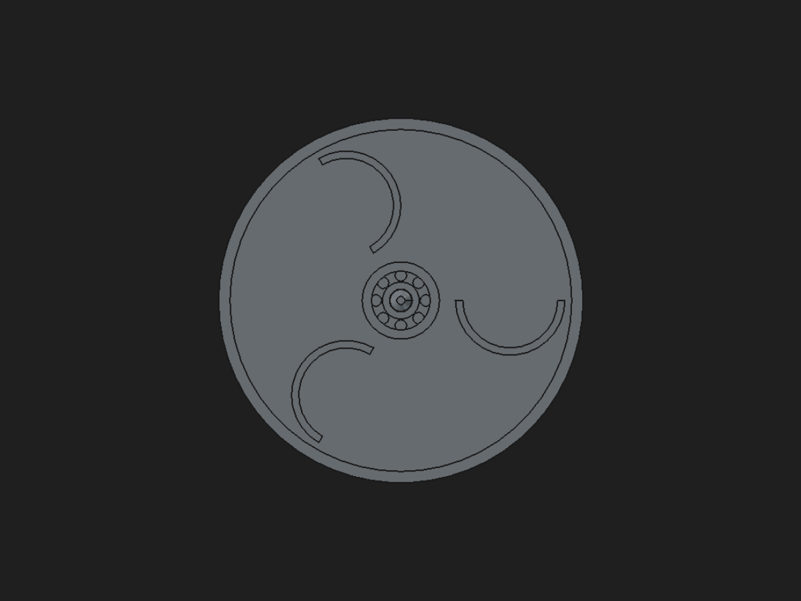
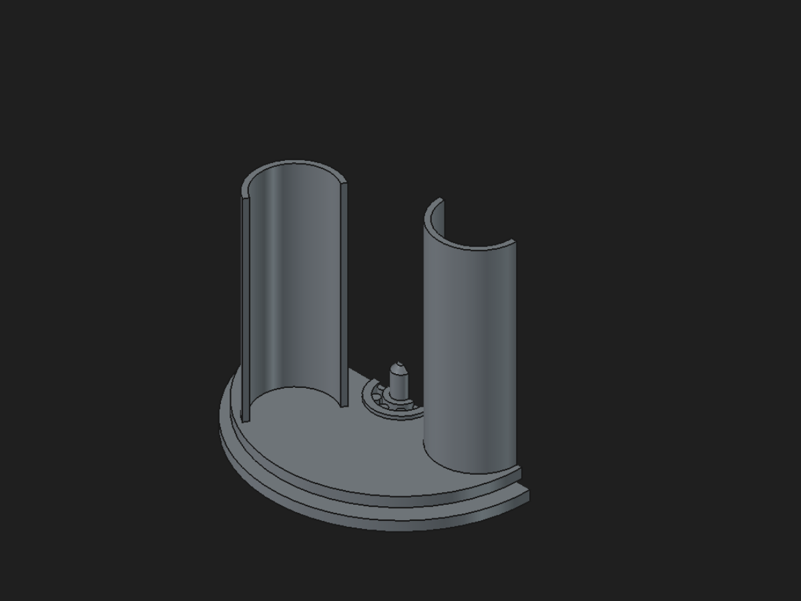

# Turbina Savonius de mesa

Uma turbina de vento de eixo vertical que gira com um sopro — **modelada do
zero por um agente de IA**, comandando o FreeCAD exclusivamente pelas
ferramentas estruturadas do TALOS: 75 mutações transacionais, 17 leituras,
nenhuma linha de Python arbitrário.


## Por que ela é uma vitrine

**Duas peças, zero parafusos, zero suporte de impressão.**

- O **rotor** carrega um **rolamento de roletes print-in-place fundido no
  próprio cubo** — os 8 roletes são impressos capturados entre as pistas
  (flutuam 1,6 mm por projeto e soltam ao girar depois de esfriar);
- a **base** tem um pino central com ponta chanfrada que entra no furo do
  rolamento com **folga radial de 0,2 mm, verificada por análise de
  interferência** na montagem digital;
- o perfil de cada pá é uma meia-coroa de arcos **totalmente restrita
  (0 graus de liberdade)** — 10 restrições geométricas ancoradas na origem e
  no eixo X do sketch, 3 cotas nomeadas e vinculadas a parâmetros mestres;
- as três pás nascem de **um único perfil** repetido por padrão polar;
- tudo é dirigido por **10 parâmetros mestres**: mudar `altura_pas` de 90
  para 120 mm ou `espessura_pa` de 2,4 para 3,2 mm recalculou o modelo
  inteiro com o volume batendo a fórmula analítica em precisão de 0,01%.



## Evidência de engenharia

| Verificação | Resultado |
| --- | --- |
| Sketches totalmente restritos | 5 de 5, antes e depois das mudanças |
| Volume vs. fórmula analítica | exato nas 3 configurações testadas |
| Interferência rotor × base | zero; folga radial 0,200 mm |
| Prontidão de impressão da base | sem suporte |
| Prontidão do rotor | sem suporte; 8 roletes flutuantes por projeto (PIP) |
| Massa (PLA 1,24 g/cm³) | rotor 230,5 g · base 152,2 g |

O corte pela linha de centro mostra o rolamento capturado e o pino no furo:



Os números completos, incluindo a telemetria da sessão MCP, estão em
[relatorio.json](relatorio.json).

## Reproduzir

1. Instale o TALOS (`.\scripts\instalar.ps1`) e abra o FreeCAD com o
   Workbench **TALOS MCP** ativo e um documento chamado `TurbinaSavonius`
   (com aprovação automática de mutações compensáveis habilitada);
2. rode o agente:

```powershell
.\.venv\Scripts\python.exe showcase\turbina-savonius\driver.py
```

O script reconstrói o modelo do zero, refaz todas as verificações e regrava
o relatório e as capturas. Para imprimir, exporte os STL do rotor e da base
pelo painel (exportação é sempre uma aprovação manual).

## Uma nota honesta de engenharia

Durante a construção, a sessão expôs um limite real do catálogo: a fusão
booleana (`cad.boolean_operation`) é estática — mudanças de parâmetro
posteriores não repropagam por ela. O driver contorna aplicando as mudanças
de parâmetro **antes** de fundir o rolamento, e o limite ficou registrado
como melhoria futura. É exatamente para achar esse tipo de coisa que os
projetos de vitrine existem.
